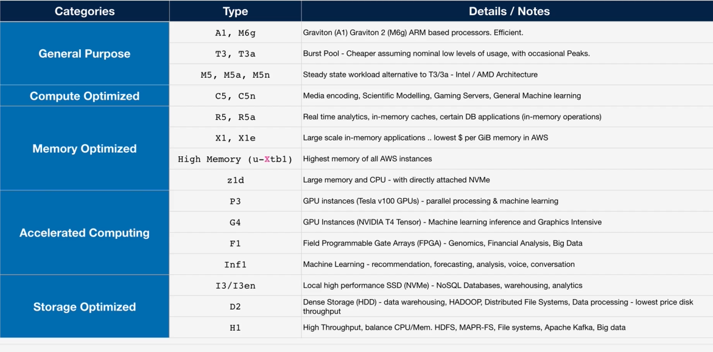
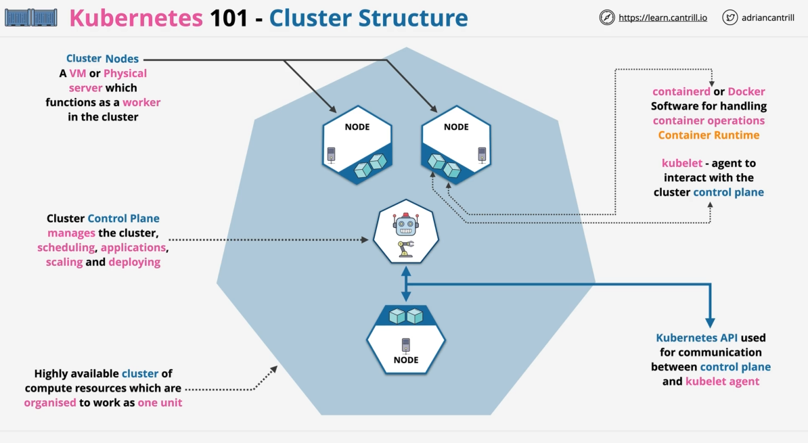

<h1 align="center"> SAA-C03 Notes (Dec 2024) </h1>
<div align="center"> I've put together these notes using the AWS Solutions Architect - Associate (SAA-C03) course by Adrian Cantril because I couldn’t find any GitHub resources that fit what I was looking for. Most were either outdated, too detailed, or too brief. These notes provide a good balance, summarizing key points in a concise, easy-to-understand format that's perfect for quick review and memorization for later. For more resources, check out [Cantril's GitHub repo](https://github.com/acantril/aws-sa-associate-saac03/) </div>

*FYI: These notes should only be used to review AWS material. They won't make sense until you've completed a course or have AWS experience.*

## Contribute

Contributions to the notes are welcome! If you find any errors or have updated notes, please do me a favor and open an issue or submit a pull request. Thanks! :relaxed:

## Table of Contents

1. [AWS Fundamentals](#1-aws-fundamentals)
2. [IAM, Accounts, and AWS Organizations](#2-iam-accounts-and-aws-organizations)
3. [Security, Identity, and Compliance](#3-simple-storage-service-s3)
4. [Virtual Private Clouds (VPC)](#4-virtual-private-cloud-vpc)
5. [Elastic Cloud Compute (EC2)](#5-elastic-cloud-compute-ec2)
6. [Containers and ECS](#6-containers-and-ecs)
7. [Advanced EC2](#7-advanced-ec2)
8. [Route 53](#8-route-53)

## 1 AWS Fundamentals

### 1.1 Public vs Private Services
- **Public Internet**: Zone for internet-based services (e.g., email, online games, streaming).
- **Private Internet**: Isolated VPCs accessible only via VPN or Direct Connect. Public internet access requires an Internet Gateway.
  - Example: On-premises systems accessing AWS resources via Direct Connect can still use Internet Gateway for public AWS services like S3.
- **AWS Public Zone**: Hosts public services like S3 but requires explicit permissions for access.

### 1.2 AWS Global Infrastructure
- **Regions**:
  - Fully deployed AWS infrastructure in areas like Ohio, Singapore, and London.
  - Key benefits: fault tolerance, compliance, performance optimization.
- **Edge Locations**:
  - Local distribution points for low-latency services (e.g., Netflix streaming from Brisbane via Sydney Edge).
- **Management and Resilience**:
  - Regions connect via high-speed networks.
  - **Global Services** (e.g., IAM) replicate across regions.
  - **Regional Services** (e.g., EC2) replicate across AZs but fail if the entire region is down.
  - **AZ-Specific Services** operate in a single AZ; fail if the AZ is down.

### 1.3 AWS Default VPC
- Default VPC per region with CIDR `172.31.0.0/16`. Default subnets provide public IPv4 addresses.
- Use custom VPCs for production due to greater flexibility.
  - Example: Default VPC's `/16` range can host multiple smaller `/20` subnets.

### 1.4 EC2 Basics
- **IaaS**: Provides virtual machines (instances).
  - Example: Web servers with specific CPU and memory.
- **Billing**: On-demand, based on CPU, memory, storage, and networking.
- **Instance States**:
  - **Running**: Uses CPU, memory, and networking.
  - **Stopped**: Retains data, no active resources.
  - **Terminated**: Data deleted, no charges.
- **AMI**: Snapshot for creating instances.
  - Region-specific; includes permissions, boot volume, and device mappings.

### 1.5 S3 Basics
- **Global Object Storage**: Resilient, accessible globally, region-specific data.
- **Objects**:
  - Key (name), Value (data), Metadata, Access Control.
  - File size: 0 bytes to 5 TB.
- **Buckets**:
  - Names must be globally unique.
  - Data resides in a single region unless explicitly moved.
  - Soft limit: 100 buckets/account; hard limit: 1000.

### 1.6 CloudFormation Basics
- Automates infrastructure using templates (YAML/JSON).
- Templates create/update stacks (living representations of resources).
  - Example: Deploying multi-tier web apps with a single template.

### 1.7 CloudWatch Basics
- **Monitoring**: Tracks metrics (e.g., CPU usage, disk I/O), logs, and events.
  - **Alarms**: Trigger actions like sending SNS notifications.
- **Dimensions**: Name-value pairs to separate data sources within a metric.

### 1.8 Shared Responsibility Model
- **AWS**: Responsible for cloud security (e.g., hardware, global infrastructure).
- **Customer**: Responsible for in-cloud security (e.g., data encryption, firewall configuration).

### 1.9 High Availability, Fault Tolerance, and Disaster Recovery
- **High Availability (HA)**: Ensures uptime (e.g., 99.9% = ~8.8 hours/year downtime).
- **Fault Tolerance (FT)**: Operates despite failures with redundancy.
- **Disaster Recovery (DR)**: Prepares for major failures with recovery plans.

### 1.10 Route53 Fundamentals
- **DNS as a Service**: Manages domain registration and zones (public/private).
  - Example: Hosting DNS records for a website.
- Globally resilient with fault tolerance across regions.

### 1.11 DNS Records
- **A/AAAA**: Maps host to IPv4/IPv6 addresses.
- **CNAME**: DNS alias for other records.
- **MX**: Mail server records with priority settings.
- **TXT**: Arbitrary text, often for domain verification.
- **TTL**: Specifies cache duration for DNS records.

### 1.12 DNS Root
- Managed by IANA; root servers guide DNS queries.
- **Root Hints**: Point to root servers for DNS resolution.

### 1.13 DNS Hierarchy
- Root zone delegates authority to TLDs (e.g., `.com`, `.org`).
- **Registry** manages zones for TLDs.
- **Registrar** facilitates domain registration under TLDs.

## 2 IAM, Accounts, and AWS Organizations

### 2.1 IAM Identity Policies
- **Policy Components**:
  - **Effect**: Allow/Deny.
  - **Actions**: Operations like `s3:GetObject`.
  - **Resources**: Targeted via ARNs.
  - **Statement ID (SID)**: Optional description.
- Policy priority: Explicit Deny > Explicit Allow > Implicit Deny.

### 2.2 IAM Users and ARNs
- **IAM Users**: Provide long-term AWS access for individuals or apps.
  - Authentication via username/password or access keys.
- **ARNs**: Uniquely identify AWS resources.
  - Example: `arn:aws:s3:::mybucket/*` targets objects in a bucket.

### 2.3 IAM Groups
- Manage multiple users with shared permissions.
  - Example: DevOps team group with read/write S3 permissions.
- Benefits: Simplifies updates, centralized management.
- Limitations: Cannot reference groups in resource policies.

### 2.4 IAM Roles
- Provide temporary credentials for specific tasks.
  - Example: Granting developers temporary S3 access via an assumed role.
- **Trust Policy**: Who can assume the role.
- **Permission Policy**: Defines role actions.
- Temporary credentials expire and require reassumption.

### 2.5 When to Use IAM Roles
- **Lambda Execution Role**:
  - Use for functions with unknown number of principals.
  - Trust Policy: Trust Lambda Service.
  - Permission Policy: Grant AWS service access.
  - Uses `sts:AssumeRole` for temporary keys (e.g., CloudWatch, S3).
  - Prefer roles over direct policy attachment.

- **Emergency Situations (Break Glass)**:
  - Role for exceptional access needs.
  - Requires justification to "break the glass."
  - Grants expanded access when necessary.

- **Integrating AWS with Corporate Environment**:
  - Use IAM roles for Single Sign-On (SSO) with identity providers (e.g., Active Directory).
  - ID Federation allows external services to assume AWS roles.

- **Web Identity Federation**:
  - IAM Roles integrate with web identities (e.g., Google, Facebook, Twitter).
  - No AWS credentials stored in the app.
  - Scales for millions of users.
  - Grants trusted web identities access to AWS resources (e.g., DynamoDB).

- **Cross-Account Access**:
  - IAM Roles allow partner accounts to access or upload to AWS resources.

### 2.6 Service-linked Roles & Passrole
- **Service-linked Roles**:
  - IAM role that is linked to a specific AWS service which can be created/deleted by it (policy)
  - Provides permissions for service to interact with other services

- **Passrole**:
  - Allows users to pass an existing role to an AWS service

### 2.7. AWS Organizations
#### Overview
AWS Organizations centralize account management for multi-account environments. Without it, each account requires individual IAM users and payment methods. Useful for organizations managing 5+ accounts.

#### Key Features:
- **Management/Master Account**: Primary account that creates and manages the organization.
- **Member Accounts**: Accounts that join the organization and delegate management to the master account.
- **Organization Root**: Container holding master and member accounts or organizational units (OUs).
- **Consolidated Billing**: Combines billing from member accounts into a single bill for the master account. Allows cost optimization via reservations and volume discounts.
- **Role Switching**: Enables switching between accounts using CLI or console.

#### Creating Accounts in an Organization:
- Only an email address is required.
- IAM users in individual accounts can be replaced with IAM roles for centralized access.

### 2.8. Service Control Policies (SCPs)

#### Overview
SCPs restrict actions that member accounts can perform. They act as a "guardrail," not granting permissions but limiting what IAM policies can allow. Master accounts cannot be restricted by SCPs (security risk).

- **Only Overlaps Allowed**: Only allow rules in both the SCP **and** the IAM policy are granted. If a rule is missing in one or the other, the action is denied.

#### Allow List vs Deny List:
1. **Deny List** (Default):
   - AWS applies `FullAWSAccess` SCP initially, allowing all actions.
   - Example: To deny all S3 access:
     ```json
     {
       "Effect": "Deny",
       "Action": "s3:*",
       "Resource": "*"
     }
     ```
   - Minimal administrative overhead.
2. **Allow List**:
   - Explicitly define allowed services. Example:
     ```json
     {
       "Effect": "Allow",
       "Action": ["s3:*", "ec2:*"],
       "Resource": "*"
     }
     ```

### 2.9. CloudWatch Logs

#### Overview
- **Purpose**: Store, monitor, and analyze logging data.
- **Architecture**:
  - **Log Events**: Data points with a timestamp.
  - **Log Streams**: Sequences of log events from the same source.
  - **Log Groups**: Containers for related log streams with shared settings (e.g., retention, permissions).
  - **Metric Filters**: Generate metrics based on log data.
- Regional service integrated with CloudWatch.

### 2.10. CloudTrail Essentials

#### Overview
Tracks API activity and user actions for auditing and compliance.

#### Key Features:
1. **Event History**: Retains 90 days of management events for free.
2. **Trails**:
   - **Single-region** or **all-region** configurations.
   - Logs events to S3 or CloudWatch Logs.
3. **Management Events**: Logs resource management activities (e.g., creating EC2 instances).
4. **Data Events**: Logs object-level activities (e.g., S3 uploads). Must be enabled explicitly.
5. **Global Services** (e.g., IAM, CloudFront): Always log to `us-east-1`.

#### Notes:
- Not real-time; ~15-minute delay.
- Pricing applies for additional trails, storage, and event data.

### 2.11. AWS Control Tower

#### Overview
- Quick and easy setup of multi-account environments
- Orchestrates other AWS services to provide this functionality
- Organizations, IAM identity center, CloudFormation, Config and more
- **Landing Zone**: Centralized management for multi-account environments
  - SSO/ID Federation, Centralized logging and auditing
- **Guard Rails**: Detect/Mandate rules/standards across all accounts
  - Mandatory, Strongly Recommended, or Elective
- **Account Factory**: Automates and standardizes account creation

## 3. Simple Storage Service (S3)

### 3.1. S3 Security

- **Private by Default**: Only the account root user has access initially.
- **Bucket Policy**: Manages access at the bucket level for cross-account or anonymous access.
  - Type of **Resource Policy**: like identity policy, but attached to bucket.
- **Access Control Lists (ACLs)**: Legacy feature; not recommended due to limitations.
- **Block Public Access**: Default setting that prevents access from public (fail-safe).

### 3.2. S3 Static Hosting

- Enables serving static websites directly from S3 via HTTP.
- Requires:
  - **Index Document**: Entry point (e.g., `index.html`).
  - **Error Document**: For error handling (e.g., `404.html`).
- Website Endpoint: Specific address that serves that page/content.
- Pricing: Costs based on storage (per GB/month), data transfer (per GB), and request rates (per 1k requests). Much cheaper than EC2 and other compute services.

### 3.3. Object Versioning and MFA Delete

- **Versioning**:
  - Retains previous versions of objects.
  - Once enabled, cannot be disabled (only suspended).
  - Delete marker hides versions without deleting them.
  - **ID**: Each object is given an ID if versioning is enabled.
- **MFA Delete**:
  - Adds MFA requirement for versioning changes or object deletions.

### 3.4. S3 Performance Optimization

1. **Multipart Uploads**:
   - For objects > 5GB, breaks data into parts for faster, fault-tolerant uploads.
   - Each part can be retried independently, reducing upload failures.

2. **S3 Accelerated Transfer**:
   - Uses AWS edge locations to improve transfer speed.
   - Ideal for large files and distant clients.

### 3.5. Key Management Service (KMS)

- **Purpose**: Manage encryption keys.
- Adheres to **FIPS 140-2 (L2)** compliance for AWS-managed keys.
- **KMS Keys**: Customer-owned keys used for cryptographic operations.
  - Logical - ID, date, policy, description & state.
  - Backed by physical key material.
  - Isolated to a single region & never leave.
  - AWS Owned or Customer Owned.
  - AWS Managed or Customer Managed.
- **Data Encryption Keys (DEKs)**:
  - Generated by KMS and used for encrypting large data.
  - KMS only stores encrypted DEKs, ensuring data security.

### 3.6. Encryption

#### Types of Encryption:
1. **At Rest**: Protects stored data (e.g., disk encryption).
2. **In Transit**: Secures data during transfer (e.g., HTTPS).

#### Methods:
- **Client-Side Encryption**: Performed by the user before data reaches S3.
- **Server-Side Encryption (SSE)**:
  1. **SSE-C**: Customer-provided keys.
  2. **SSE-S3**: AWS-managed keys.
  3. **SSE-KMS**: Keys managed by AWS KMS, allowing role-based access.

### 3.7. S3 Storage Classes

1. **Standard**: High durability and availability; low latency.
  - Used for **frequently accessed data** that is important.
  - Replicated over 3 AZs.
  - **HTTP/1.1 200 OK** response is provided by S3 API Endpoint when objects are stored.
  - Billed GB/month fee for data stored, $ per GB for transfer out (in is free), and $ per 1000 requests.
2. **Standard-IA**: Lower cost for infrequent access.
  - Used for **long-lived data** which is important but not frequently accessed.
  - Same as Standard but with retrieval fee (per GB).
  - Minimum duration charge of 30 days.
3. **One Zone-IA**: Cost-effective for less critical data stored in one AZ.
  - Used for **long-lived data** that is not critical and not frequently accessed.
  - Stored only in 1 AZ.
4. **Glacier Instant**: Cheaper storage, more expensive retrieval, longer minimum.
  - Used for long-lived data accessed **once per quarter** with millisecond access.
5. **Glacier Flexible** Archival storage with retrieval times of minutes to hours.
  - Requires retrieval process: Expedited (1-5 minutes), Standard (3-5 hours), Bulk (5-12 hours).
6. **Glacier Deep Archive**: Cheapest option for long-term archival with retrieval in hours to days.
7. **Intelligent-Tiering**: Automatically moves objects between storage classes based on usage.


### 3.8. Object Lifecycle Management

- **Lifecycle configuration**: Set of rules consisting of actions on a bucket or group of objects.
  - Transition Actions and Expiration Actions
- Automates transitions between storage classes or object expiration.
  - Minimum of **30 days** before transition.
- Example:
  - Move to Standard-IA after 90 days.
  - Archive to Glacier after 1 year.

### 3.9. S3 Replication

1. **Cross-Region Replication (CRR)**:
   - Replicates objects between buckets in different regions.
2. **Same-Region Replication (SRR)**:
   - Replicates objects within the same region.
3. Within same account or between different accounts.
  - Need a bucket policy at destination account to allow Source Role to transfer.

#### Key Notes:
- Requires versioning enabled on both buckets.
- Cannot replicate retroactively.
- Handles SSE-S3, SSE-KMS, and SSE-C.
- Source bucket owner needs permissions to objects.
- No system events, Glacier, or Glacier Deep Archive.

### 3.10. S3 Presigned URLs

- **Purpose**: Provide temporary access to S3 objects without sharing credentials.
- **Parameters**:
  - Security credentials.
  - Bucket and object key.
  - Expiry time.
- The permissions of the URL match the identity which generated it.

### 3.11. S3 Select and Glacier Select

- Retrieve specific parts of an object using SQL-like queries.
- Reduces data transfer and retrieval costs.

### 3.12. S3 Event Notifications

- Notification generated when events occur in a bucket
- Can be delivered to SQS, SNS, or Lambda.
- **Event Types**:
  - Object Created
  - Object Deleted
  - Object Restore
  - Object Replication

### 3.13. S3 Object Locks

- Store objects using a write-once-read-many (WORM) model.
- Prevent objects from being deleted or overwritten for a fixed amount of time or indefinitely.
- Requires versioning
- Retention period: days & years
- Architectures: Legal Hold, Governance, & Compliance
  - Compliance: Can't be adjusted, deleted, or overwritten.

### 3.14. S3 Access Points

- Simplify managing access to S3 buckets/objects.
- Create multiple access points for different use cases, policies, and network access controls.
- Created via Console or **aws s3control create-access-point** command.

## 4 Virtual Private Cloud (VPC)

### 4.1 Networking Refresher

#### IPv4 - RFC 791 (1981)
- Uses **dotted decimal notation**: 4 numbers (0-255) separated by periods.
- Total: **~4.3 billion addresses**.
- Limitation: Inflexible sizing; some addresses often go unused.

#### Classful Addressing
- **Class A**: `0.0.0.0 - 127.255.255.255` (Large companies; 128 networks).
- **Class B**: `128.0.0.0 - 191.255.255.255` (Medium organizations).
- **Class C**: `192.0.0.0 - 223.255.255.255` (Small networks).

#### Internet/Private IPs - RFC1918
- **Private IP ranges** (not internet-routable):
  - **Class A**: `10.0.0.0 - 10.255.255.255`
  - **Class B**: `172.16.0.0 - 172.31.255.255`
  - **Class C**: `192.168.0.0 - 192.168.255.255`

#### Classless Inter-Domain Routing (CIDR)
- CIDR notation: `<network address>/<prefix>`.
  - **Example**: `10.0.0.0/16` (65,536 addresses).
  - Larger prefix = smaller network, e.g., `/20` splits `/16` into 16 subnets.

#### Key IP Address Notations
- `0.0.0.0/0`: All IPs.
- `10.0.0.0/8`: All IPs starting with `10` (Class A).
- `10.0.0.0/16`: All IPs starting with `10.0` (Class B).
- `10.0.0.0/32`: Single IP address.

#### Packets
- Contains:
  - **Source IP**
  - **Destination IP**
  - **Data**
- Uses protocols:
  - **TCP** (connection-oriented).
  - **UDP** (connectionless).
- Ports allow multiple concurrent communications.

#### IPv6 - RFC 8200 (2017)
- Format: `2001:0db8:28ac::82ae:3910:7334`.
- Total: **128-bit** addresses (vastly larger than IPv4).
- CIDR notation applies, e.g., `2001:db8::/48` spans addresses `2001:db8:0000::` to `2001:db8:ffff::`.
- `::/0` covers all IPv6 addresses.

### 4.2 VPC Sizing and Structure

#### VPC Considerations
- **Size**: Plan VPC size to avoid overlap with other VPCs or cloud networks.
- **Range**: Use uncommon ranges, e.g., `10.16.x.x`.
  - Min: `/28` (16 IPs).
  - Max: `/16` (65,536 IPs).
- Reserve ranges per region/account for scalability.

#### Subnet Sizing
- Subnets are **AZ-specific**.
- Best practice: Use at least **4 AZs** with separate tiers (web, app, DB, spare).
- Example: Splitting `/16` into `/20` provides **16 subnets**.

### 4.3 Custom VPC

#### Features
- **Regionally isolated and resilient**.
- No inbound/outbound traffic without explicit configuration.
- **Hybrid Networking**: Connects on-prem/cloud environments.
- Tenancy options:
  - **Default**: Shared hardware.
  - **Dedicated**: Isolated hardware (higher cost).

#### Key Facts
- **IPv4**: Mandatory CIDR block (min `/28`, max `/16`).
  - Can add up to **5 secondary CIDR blocks**.
- **IPv6**: Assigned `/56` CIDR (public by default).
- **DNS Support**: Provided by Route 53.
  - IP: `<VPC Base> + 2` (e.g., `10.0.0.2`).
  - Options:
    - **DNS Hostnames**: Assign public DNS to instances.
    - **DNS Resolution**: Enable VPC DNS access.

### 4.4 VPC Subnets

#### Subnet Features
- **AZ-resilient**: Subnets fail if the AZ fails.
- IPv4 CIDRs: Cannot overlap within the VPC.
- IPv6: Optional allocation.
- **Communication**: Subnets in the same VPC communicate by default.

#### Reserved IPs
- **5 reserved IPs** per subnet:
  1. Network address (e.g., `10.16.16.0`).
  2. VPC router (`10.16.16.1`).
  3. DNS (`10.16.16.2`).
  4. Future AWS use (`10.16.16.3`).
  5. Broadcast (`10.16.31.255`).

#### DHCP Options Set
- Automates IP assignment.
- Cannot edit; create new set if changes are needed.

#### IP Allocation
- **Public IPv4**: Enabled to make subnets public.
- **IPv6**: Requires subnet and VPC IPv6 allocations.

### 4.5 VPC Routing and Internet Gateway (IGW)

#### VPC Router
- Moves traffic between subnets.
- Route tables define outbound traffic behavior.
  - Each subnet uses the **main route table** unless explicitly associated with a custom table.

#### Route Tables
- Matches destination IPs against routes.
- **Local routes** (within VPC) cannot be modified and take precedence.

#### Internet Gateway (IGW)
- **Enables external connectivity** for VPCs.
- **Regional service**: Covers all AZs in a region.
- Attach to VPC:
  - No IGW = private VPC.
  - One IGW = public VPC.
- Steps:
  1. Create IGW.
  2. Attach IGW to VPC.
  3. Create custom route table (RT).
  4. Associate RT.
  5. Default Routes => IGW.
  6. Subnet allocate IPv4.

#### IGW Functionality
- **Private-to-Public Translation**: Maps private IPs to public IPs for external access.
- **IPv6**: Public by default; no translation needed.

#### Bastion Host / Jumpbox

- An instance in public subnet where incoming management connections arrive.
- Used as an inbound management point, or as an entry point for private-only VPCs.

### 4.6 Stateful vs Stateless Firewalls
- Every connection has a request and a response.
- Both can be in either direction inbound/outbound (based on perspective).
- **Stateless**: Doesn't understand state of connections.
  - Need 2 rules (1 IN, 1 OUT) per connection.
- **Stateful**: Can identify the request and response components of a connection as being related.
  - Allowing request means response is automatically allowed.

### 4.6 Network Access Control Lists (NACLs)

#### Features
- **Stateless**: Separate inbound and outbound rules.
- **Subnet-level**: Filters traffic crossing subnet boundaries.
- Rules processed in order, lowest number first.
- Fields:
  - **Type**: Protocol (TCP/UDP/ICMP).
  - **Port Range**.
  - **Source/Destination**.
- Default implicit deny (`*`).

#### Example
- Allow HTTPS (TCP/443) inbound.
- Add outbound ephemeral ports (`1024-65535`) for response traffic.

#### Exam PowerUp
- Use NACLs for:
  - Explicit deny (e.g., blocking bad IPs).
  - Non-SG-compatible resources (e.g., NAT Gateways).

### 4.7 Security Groups (SGs)

#### Features
- **Stateful**: Tracks inbound/outbound traffic automatically.
- **Resource-level**: Attached to ENIs (Elastic Network Interfaces), not instances or subnets.
- Default SG:
  - Allows all traffic within the group.
  - Implicit deny for everything else.
- **Logical referencing**: When you reference an SG from another SG, you're implicitly referencing any resources associated with that SG.

#### Exam PowerUp
- Use SGs as the default for most configurations.
- Combine with NACLs for explicit deny scenarios.

### 4.8 Network Address Translation (NAT) Gateway

#### Features
- Gives Private CIDR range **outgoing** internet access.
- **IP Masquerading**: Hides CIDR blocks behind one IP.
- **Elastic IPs**: Static public IPs.
- AZ-resilient but not region-resilient (deploy in multiple AZs for HA).

#### Comparison
- **NAT Gateway**:
  - Managed service; scales up to **45 Gbps**.
  - No port forwarding or bastion host capabilities.
- **NAT Instance**:
  - On a EC2 Instance.
  - Customizable but single-point-of-failure.

#### IPv6 Note
- NAT not required for IPv6; all IPv6 addresses are public.

## 5 Elastic Cloud Compute (EC2)

### 5.1 Virtualization 101

#### Server Configuration Without Virtualization
- **CPU Hardware**: Handles all computations.
- **Kernel**: Operates in privileged mode, interacts directly with hardware.
- **User Mode**: Runs applications, interacts with hardware via system calls.
  - Direct hardware interaction without system calls leads to errors/crashes.

#### Types of Virtualization

- **Emulated Virtualization (Software Virtualization)**
  - **Host OS** includes a hypervisor (HV) that emulates hardware for guest OS.
  - HV performs binary translation for system calls.
  - Slower but no guest OS modification needed.

- **Para-Virtualization**
  - Guest OS is modified to make hypercalls instead of system calls.
  - Faster since binary translation is avoided.

- **Hardware-Assisted Virtualization**
  - Virtualization-aware hardware (CPU traps privileged instructions).
  - Input/output operations like disk I/O and network sharing are crucial.

- **SR-IOV (Single Root I/O Virtualization)**
  - Physical hardware presents multiple virtual interfaces for enhanced networking
  - Fastest I/O speed
  - Called "Enhanced Networking" in EC2

### 5.2 EC2 Architecture and Resilience

- Virtual machines (OS + Resources)
- Run on EC2 Hosts
- Good for:
  - Traditional OS+Application Computer
  - Long-running computer
  - Server style applications
  - Monolithic application stacks
  - Migrating application workloads

#### EC2 Hosts and Tenancy
- **Shared**: Instances share hardware but are isolated.
- **Dedicated**: Hardware exclusive to a customer; instances from the same account can share it.
- **Dedicated Host**: Entire physical server is dedicated to a single customer.

#### Availability Zone (AZ) Resilience
- Instances are tied to **one AZ**.
- Data and storage (e.g., EBS) are specific to the AZ.
- Relocation occurs on host failure but stays within the same AZ.

#### EC2 Networking
- Instances are provisioned with **Elastic Network Interfaces (ENI)**, mapping to subnets in one AZ.
- Instances can have multiple ENIs, even across subnets, provided they remain in the same AZ.

### 5.3 EC2 Instance Types

- **General Purpose (A, T, M)**: Balanced CPU and memory for steady-state workloads.
- **Compute Optimized (C)**: High-performance computing, gaming, and scientific modeling.
- **Memory Optimized (R, X)**: Large in-memory datasets.
- **Accelerated Computing (P, G, F)**: GPUs, FPGAs.
- **Storage Optimized (H, I, D)**: High-speed storage for analytics and search workloads.



#### Instance Naming Scheme
- **Example**: `R5dn.8xlarge`.
  - `R`: Instance family.
  - `5`: Generation (newest recommended).
  - `dn`: Capabilities (e.g., `d` = NVMe storage, `n` = network optimized).
  - `8xlarge`: Size (memory/CPU).

### 5.4 Storage Refresher

#### Types of Storage
- **Direct (local) attached Storage**: Storage on the EC2 Host.
- **Network attached Storage**: Volumes delivered over the network (EBS).
- **Ephemeral Storage**: Temporary storage within the instance (EC2).
- **Persistent Storage**: Permanent storage - lives past the lifetime of instance (EBS).

#### Categories of Storage
- **Block Storage**: Presented as raw volumes, mountable, bootable (e.g., EBS). 
  - Use cases: Virtual machine OS, databases.
  - Scalable only up to disk size, High throughput, Low latency.
- **File Storage**: Shared file systems, mountable, not bootable (e.g., EFS). 
  - Use cases: Web servers, file systems.
  - Scales dynamically, with moderate latency.
- **Object Storage**: Flat data storage, not mountable or bootable (e.g., S3). 
  - Use cases: Backups, data lakes, unstructure data.
  - Unlimited scalabness, variable latency.

#### Storage Performance Metrics
- **IO Block Size**: Determines data segmentation.
- **IOPS**: Number of read/write operations per second.
- **Throughput**: Data transfer rate (MB/s).
  - **Formula**: Block Size × IOPS = Throughput.

### 5.5 Elastic Block Store (EBS)

#### Key Features
- **Block Storage**: Raw disk allocations (volume).
- **AZ Resilient**: provides persistent block storage tied to **one AZ**.
- Data replication ensures high availability within the AZ.
- Snapshot (backup) into S3 for region-resilient backups.
- Four volume types:
  - **General Purpose SSD (gp2)**: Default for most workloads, 100 IOPS minimum.
    - Newer gp3: 3000 IOPS & 125MiB/s standard. 20% cheaper than gp2. Faster throughput.
  - **Provisioned IOPS SSD (io1/2)**: High IOPS, multi-attach support, up to 64,000 IOPS.
  - **Throughput-Optimized HDD (st1)**: High throughput for sequential workloads.
  - **Cold HDD (sc1)**: Cost-efficient, less frequently accessed data.

#### Snapshots and Restores
- Incremental snapshots to S3 for region-resilient backups.
- **Lazy Restore**: Data restored in the background; immediate access triggers on-demand restore.
- **Fast Snapshot Restore (FSR)**: Enables instant restores, billed per snapshot and AZ.


### 5.6 Instance Store Volumes

- **Block Storage** devices
- Local ephemeral storage tied to an EC2 host.
- **ATTACHED AT LAUNCH ONLY**, can't be added later.
- **High performance** but data is lost when:
  - Instance is stopped or moved.
  - Hardware fails or undergoes maintenance.
- Only available at launch, included in instance cost.
- **More IOPS and throughput** than EBS.

### 5.7 EBS vs Instance Store

#### Use Cases
- **EBS**: Persistent, reliable, and flexible storage.
  - Cheap = ST1 or SC1
  - Only up to 260,000 IOPs, even with RAID0 (combined EBS volumes).
- **Instance Store**: Temporary storage with high IOPS and throughput. Cost already included in instances.
  - Can do more than 260,000 IOPs.

### 5.8 EBS Snapshots, Restore, and Fast Snapshot Restore (FSR)

- **Snapshots**: backups of data consumed within EBS Volumes - **Stored on S3**.
- Incremental: first is a full copy of volume 'data', future are incremental.
- Can be used to migrate data to different availability zones in a region, or to different regions of AWS.
- **Snaps restore lazily** - fetched gradually.
- **FSR**: Enables instant restores, billed per snapshot and AZ. Up to 50 snaps per region.

### 5.9 EBS Encryption
- Provides at-rest encryption using **AES-256**.
- Managed by **AWS KMS** with unique Data Encryption Keys (DEKs) per volume.
- Each volume uses 1 unique DEK.
- Snapshots and future volumes inherit encryption from their source volumes.
- **Important**: Encryption is seamless, with no performance impact.

### 5.10 EC2 Network Interfaces, IPs, and DNS

#### Elastic Network Interface (ENI)
- 1 Primary and multiple Secondary ENIs available.
  - Secondary ENIs: Can detach and move.
- **Properties**:
  - **Primary IPv4**: Static for the instance lifetime.
  - **Public IPv4**: Dynamic, assigned only in public subnets.
    - Assigned by IGW - OS never sees public IPv4.
  - **Security Groups**: Apply at the ENI level.
  - **Elastic IPs**: Can be assigned to private IPs for fixed public access.
    - Removed the public IPv4 and replaces with Elastic IP.
  - Public DNS = Private IP in VPC, Public IP everywhere else.

### 5.11 Amazon Machine Image (AMI)

#### AMI Lifecycle
- **Create AMI**: Capture EC2 configurations (EBS snapshots, block device mappings).
- AMI Lifecycle:
  1) Launch
  2) Configure 
  3) Create Image
  4) Launch
- **Launch Instances**: Deploy identical instances based on AMI.
- **Permissions**: Control access (default: private).

#### Exam Tips
- AMIs are **regional**; copy to other regions as needed.
- AMI Baking: creating an AMI from a configured instance + application.
- AMI can't be edited.
- Can be copied between regions.
- Billing applies for EBS snapshots associated with the AMI.

### 5.12 EC2 Purchase Options (Launch Types)

- **On-Demand**: No commitments, pay per second/hour.
- **Spot Instances**: Up to 90% discount, terminated when bid exceeds spot price.
- **Reserved Instances**: Up to 75% discount, commitment of 1 or 3 years.
- **Dedicated Hosts**: EC2 Host allocated to you in entiriety. Pay for Hosts, no instance charges.
  - Capacity management required.
  - Better for licensing requirements
- **Dedicated Instances**: You don't own or share host. Extra charges for instances, but dedicated hardware.

### 5.13 Scaling Options

#### Vertical Scaling
- Increase instance size to handle more load (requires reboot).
- **Limitations**: Expensive and downtime during scaling.

#### Horizontal Scaling
- Add instances with a load balancer.
- Requires application support or off-host sessions.
- **Benefits**:
  - Stateless applications: application doesn't care which instance it connects to.
  - No disruption during scaling.
  - Cost-efficient with smaller instances.

### 5.14 Instance Metadata

- Accessible via: `http://169.254.169.254/latest/meta-data/`.
- Contains details about the instance (e.g., IPs, user data).
- **Important**: Metadata access is not authenticated or encrypted.

## 6 Containers and ECS

### 6.1 Intro to Containers

#### Virtualization Problems
- Traditional EC2 VMs (e.g., 4 GB RAM, 40 GB disk with Nitro Hypervisor):
  - OS can consume **60-70% of the disk** and significant memory.
- **Containers** optimize resource usage by removing duplicate OS elements, allowing applications to run in isolated environments.

#### Image Anatomy
- Docker images are built from **multiple independent layers**, not monolithic.
- Each layer corresponds to a line in the **Dockerfile**.
- **Images** are read-only, while **containers** add a read/write layer for execution.
- Shared architecture minimizes disk space usage across containers with similar base layers.

#### Image Usage
- A **Docker image** becomes a running **Docker container** with a writable layer added.
- Base layers (OS) are often provided by vendors via **container registries** (e.g., Docker Hub).

#### Container Registry
- **Container Registry**: Repository for storing and sharing container images (e.g., Docker Hub, AWS ECR).
- Workflow:
  1. Use a **Dockerfile** to create an image.
  2. Upload the image to a registry (private or public).
  3. Deploy containers to Docker hosts (running a container engine).

#### Container Key Concepts
- **Dockerfile** builds container images.
- **Portability**: Containers run identically across compatible hosts.
- **Lightweight**: Uses host OS resources efficiently.
- **Shared Layers**: Reduces redundancy and disk usage.
- **Ports**: Expose for external communication.
- **Multi-Container Applications**: Supports complex application stacks.

### 6.2 Elastic Container Service (ECS) Concepts
- ECS is a **managed container-based compute service** for running containers.
- Operates in two modes:
  1. **EC2 mode**: Leverages EC2 instances for container orchestration.
  2. **Fargate mode**: Serverless, no EC2 management required.

#### Key Components
- **Cluster**: Logical group where containers run.
  - Can span **multiple AZs** within a VPC.
- **Container Definition**:
  - Specifies image source, ports, and minimal container info.
- **Task Definition**:
  - Includes resources, task roles (IAM), and permissions for AWS services.
- **ECS Service**:
  - Configures scaling and high availability via service definitions (e.g., how many tasks to run).

### 6.3 ECS Cluster Types

#### Scheduling and Orchestration
ECS manages:
- **Cluster Management**: Organizes resources.
- **Task Placement**: Determines where containers run.

#### EC2 Mode
- **Cluster in a VPC**: Benefits from multi-AZ resilience.
- Requires managing EC2 instances (not serverless).
- Autoscaling Group (ASG): Control horizontal scaling of EC2 instances.
- **ECR**: Container registry for storing container images.
- Supports:
  - **Spot pricing** for cost-efficiency.
  - Prepaid EC2 for predictable costs.

#### Fargate Mode
- **Serverless**: No EC2 management required.
- Tasks are injected into the VPC with **elastic network interfaces** and VPC IPs.
- Billing is based on **container resource usage**, not instance size.

#### EC2 vs ECS (EC2) vs Fargate
- Use **ECS** for containerized workloads.
- **EC2 mode**:
  - Ideal for large workloads with cost sensitivity (supports spot pricing).
- **Fargate**:
  - Suitable for burst-style, batch, or periodic workloads.
  - Reduces operational overhead for small workloads.

### 6.4 Elastic Container Registry (ECR)

#### Container Registry
- **Container Registry**: Repository for storing and sharing container images (e.g., Docker Hub, AWS ECR).
- Each AWS account has a public and private registry -> Each registry can have many repositories -> Each repository can have many images.
- Integrated with IAM for permissions
- Inspector: basic, and enhanced image scanning
- Metrics: real-time metrics with Cloudwatch (auth, push, pull, etc.)
- API Actions using Cloudtrail
- Events -> Eventbridge

### 6.5 Kubernetes 101

#### Kubernetes
- **Kubernetes**: Container-orchestration platform for automating the deployment and scaling of containerized applications.
- Cluster: A deployment of Kubernetes, management, orchestration.
- Node: Resources; pods are placed on nodes to run.
- Pods: Smallest units of computing in Kubernetees. Pods are non-permanent.
- Service: Abstraction, service running on 1 or more pods.
- Job: Ad-hoc, creates one or more pods until completion.
- Ingress: Exposes a way into a service (Ingress => Routing => Service => 1+Pods).
- Ingress Controller: used to provide ingress (e.g. AWS LB Controller).
- Persistent Storage (PV) - Volumes

 

### 6.5 Elastic Kubernetes Service (EKS)

- AWS Managed Kubernetes Service - open source and cloud agnostic
- AWS, Outposts, EKS Anywhere, EKS Distro
- Runs on multiple AZs
- Integrates with AWS services (ECR, ELB, IAM, VPC)
- EKS Cluster: EKS Control Planes, and EKS Nodes
- Nodes - Self managed, managed node groups, or Fargate pods

## 7 Advanced EC2

### 7.1 Bootstrapping EC2 Using User Data

**Bootstrapping**: Automates the configuration of an EC2 instance during launch by running scripts or configuration steps passed as **user data**.

- **Process**:
  - User data is injected into the instance via the metadata IP: `http://169.254.169.254/latest/user-data`.
  - Executed once during the first launch.
  - Used for software installs and configurations.

**Key Points**:
- EC2 does not validate user data; the OS must understand it.
- User data size is limited to **16 KB**.
- User data can be modified by stopping, changing, and restarting the instance, but it won’t re-execute.

**Boot-Time-to-Service Optimization**:
- Use AMI baking for time-intensive tasks.
- Reserve bootstrapping for final configuration to reduce service readiness time.

### 7.2 AWS::CloudFormation::Init (cfn-init)

`cfn-init`: A helper script for EC2 instances, used for more advanced configuration management.

- Procedural (User Data) or desired state configurations (cfn-init).
  - E.g., installing specific package versions, managing OS users, and downloading files.
- Configuration data is passed via CloudFormation templates (`AWS::CloudFormation::Init`).

**CreationPolicy and Signals**:
- Ensures CloudFormation waits for instance provisioning before marking as complete.
- Timeout values can be set to prevent premature state changes.

### 7.3 EC2 Instance Roles

**IAM Roles** for EC2 provide temporary, auto-rotated credentials via the metadata service:

- Credentials path: `iam/security-credentials/<role-name>`.
- Best practice: Use IAM roles instead of storing credentials on instances.
- Automatically integrated with AWS CLI and SDKs.

**Instance Profile**:
- Links roles to EC2 instances.
- Created automatically when roles are added via the console.

### 7.4 SSM Parameter Store

**Parameter Store** securely stores configuration and secrets (e.g., database strings, passwords):

- Parameter types: Strings, stringlist, and secure strings.
- Supports plaintext and encrypted strings (via KMS).
- Features:
  - Hierarchies and versioning.
  - Public parameters (e.g., latest AMI IDs).
  - Accessible via IAM roles.

### 7.5 System and Application Logging on EC2

**CloudWatch Agent**:
- Required to capture instance-level OS logs for **CloudWatch Logs**.
- Configuration stored in **Parameter Store**.

**IAM Role**:
- Provides permissions for the CloudWatch Agent to interact with AWS services.

**Log Architecture**:
- Log groups: Represent individual log types.
- Log streams: Separate logs per instance.

### 7.6 EC2 Placement Groups

#### Cluster Placement
- Instances are physically close for maximum performance.
- Use cases: High-speed networking (e.g., **10 Gbps single stream**), low latency.
- Limitations:
  - Single AZ only.
  - Hardware failure impacts all instances.
- Best practice: Launch all instances at once.

#### Spread Placement
- Instances are separated for high availability.
- Use cases: Critical applications requiring resilience.
- Key points:
  - Maximum of **7 instances per AZ**.
  - Supported across multiple AZs.

#### Partition Placement
- Instances are grouped but separated across partitions.
- Use cases: Distributed systems like HDFS, Cassandra.
- Key points:
  - **7 partitions per AZ**.
  - Instances can be assigned to specific partitions or auto-placed by AWS.

### 7.7 EC2 Dedicated Hosts

Dedicated Hosts allocate physical servers exclusively to your account:

- **Use cases**: License management and compliance.
- Pricing: On-demand or reserved (1 or 3 years).
- Limitations:
  - Some AMIs may not be compatible.
  - Does not support RDS or placement groups.

### 7.8 Enhanced Networking

**Enhanced Networking**:
- Uses **SR-IOV** for direct hardware access.
- Benefits:
  - Higher bandwidth and packets-per-second.
  - Lower latency and reduced CPU usage.

**EBS Optimization**:
- Provides dedicated bandwidth for storage networking.
- Enabled by default on most new instance types at no extra cost.

## 8. Route-53

- Note: Routing policies listed at the bottom of this section.

### 8.1. Public Hosted Zones

- A hosted zone is a DNS database for a given section of global DNS data.
- **Public hosted zones** are hosted on Route 53’s public DNS name servers.
  - AWS provides at least **4 DNS name servers** for each hosted zone.
  - Globally resilient service due to multiple DNS servers.

#### Features
- Automatically created when you register a domain with Route 53.
- Can also be created separately for domains registered elsewhere.
- Fee structure includes:
  - **Monthly fee per hosted zone**.
  - **Query charges**.

#### Key Points
- Hosted zones are authoritative for their domain, serving as the **single source of truth**.
- VPC instances use the **VPC +2 address**(R53 Resolver) as their DNS resolver to query Route 53 public and internet-hosted DNS zones.

### 8.2. Private Hosted Zones

- Similar to public hosted zones but restricted to associated VPCs.
- Accessible only within those VPCs via the Route 53 resolver.

#### Split-View DNS
- Public and private hosted zones can share the same domain name.
- **Use case**: Public hosted zone contains records accessible from the internet, while private hosted zone includes internal records for VPC use.

### 8.3. CNAME vs ALIAS

- **CNAME**: Maps a NAME to another NAME.
  - `www.catagram.io` maps to `catagram.io`.
  - Invalid for naked/apex records.
- **ALIAS**: Maps a name or an AWS record.
  - Can be used both for naked/apex and normal records.
  - No charge for ALIAS requests.
  - **DEFAULT** option for AWS services.

### 8.4. Route 53 Health Checks

- Health checks allow periodic monitoring of servers and resources.
- Unhealthy servers are automatically removed; healthy ones are re-added.

#### Features
- **Independent of DNS records** but utilized by them.
- Performed by a fleet of global health checkers.
  - **Blocking checkers as bots may cause alarms**.

#### Check Types
1. **TCP Checks**:
   - Verifies TCP connection establishment within 10 or 30 seconds.
2. **HTTP/HTTPS Checks**:
   - Confirms a **200/300 status code** response within 3 seconds.
3. **HTTP/HTTPS String Matching**:
   - Validates the presence of a specific string in the body (first 5120 bytes).

#### Health Check Categories
- **Endpoint Checks**: Directly monitor resource health.
- **CloudWatch Alarms**: Trigger actions based on custom metrics.
- **Calculated Checks**: Aggregate multiple checks.

#### Frequency
- Default: Every **30 seconds**.
- Optional: **10-second checks** (higher cost).

### 8.5. Route 53 Routing Policies

1. **Simple Routing**:
   - Routes traffic to a single resource.
   - No health checks.
   - Client receives a random response from available values.

2. **Failover Routing**:
   - Two records: **Primary** and **Secondary**.
   - Uses health checks to implement active-passive failover.
   - If primary fails, secondary is used.

3. **Multi-Value Routing**:
   - Similar to simple routing but incorporates health checks. Combination of Simple Routing and Failover Routing.
   - Responds with all healthy records, removing unhealthy ones.
   - **Use case**: Reliability improvement and lightweight alternative to failover.

4. **Weighted Routing**:
   - Multiple records of the same name with assigned weights.
   - Distributes traffic based on weights.
   - Skips unhealthy records.
   - **Use case**: Gradual migrations or traffic distribution.

5. **Latency-Based Routing**:
   - Directs traffic to the region with the lowest latency for the user.
   - Multiple records of the same name and type.

6. **Geolocation Routing**:
   - Matches queries based on:
     1. **State**
     2. **Country**.
     3. **Continent**.
     4. **Default** (if no specific match).
   - **NOT about closest record or proximity.** It retuns relevant locations only! Route traffic based on location of customers.
   - **Use case**: Licensing or region-specific responses.
   - Overlapping regions prioritize the most specific match.

7. **Geoproximity Routing**:
   - Routes traffic based on geographic location and your resources.
   - Similar to Latency-based, but is based **distance** instead of latency.
   - **Bias**: Expands or shrinks the size of a geographic region from which traffic is routed to a specific resource.

### 8.6. Route 53 Interoperability

- Route 53 can be used as both **Domain Registrar** and **Domain Hosting**, but they both function **independently**.
- As a hoster:
  1) Allocates 4 name servers (NS)
  2) Creates a zone file on the above NS
- As a registrar:
  1) Accepts your money
  2) Communicates with registry of TLD
  3) Sets NS records for domain to point at the 4 NS

### 8.7. DNSSEC with Route53

- DNSSEC: Strengthens authentication in DNS using digital signatures based on public key cryptography.
- "Adds a layer of security by enabling authenticated answers on top of an otherwise insecure protocol. Whereas HTTPS encrypts traffic so nobody on the wire can snoop on your Internet activities, DNSSEC merely signs responses so that forgeries are detectable." - Cloudflare

## 9. Relational Database Service (RDS)

### 9.1. Database Refresher

#### Relational (SQL)

- SQL databases use **schemas** to define structured data with predefined relationships.
  - Schema specifies names, valid values, and data types.
- Tables include:
  - **Primary keys**: Unique identifiers for every row in each table.
  - Relationships between tables defined by **foreign keys** and **join tables**. 
- Relationships must be defined in advance, which can be challenging.

#### Non-Relational (NoSQL)

- NoSQL databases often lack a fixed schema or have a weak one.

**Key-Value Databases**

- Stores data as unique key-value pairs.
- Highly scalable and fast; ideal for **in-memory caching**.

**Wide Column Store**

- Example: DynamoDB.
- Uses **partition keys** and optional **sort keys**.
- Attributes can vary by item but must have unique keys.

**Document Databases**

- Stores data in JSON or XML format.
- Suitable for nested data structures, e.g., user profiles.

**Row Databases (MySQL)**

- Optimized for transactional operations (OLTP).
- Best for frequent row-based queries.

**Column Databases (Redshift)**

- Stores data by columns, ideal for analytics and reporting.

**Graph Databases (AWS Neptune)**

- Nodes represent entities, and edges define relationships.
- Excellent for relationship-driven data like social networks.

### 9.2. ACID vs BASE

- **CAP Theorem**: Consistency, Availability, and Partition Tolerance
  - Consistency: Every read will receive the most recent write.
  - Availability: Every request will receive a non-error response.
  - Partition Tolerance: System will continue to operate even if there are dropped messages or errors.
  - Any database is capable of delivering only 2 of these.

- **ACID**: Focuses on Consistency. Used by Financial Institutions.
  - RDS databases
  - **A**tomicity: All or None components of transaction are executed.
  - **C**onsistency: Databases only moves from one valid state to another.
  - **I**solation: Transactions don't interfere with each other.
  - **D**urability: Transactions stay committed even if system fails.
  
- **BASE**: Focuses on Availability
  - NoSQL databases like DynamoDB
  - **B**asically **A**vailable: Read and Write operations available as much as possible.
  - **S**oft state: Database doesn't enforce consistency, it's offloaded to application.
  - **E**ventually Consistent: Consistency will eventually happen, if we wait long enough.
  - Advantage: High scalable and high performance.

### 9.3. Databases on EC2

*Generally considered bad practice in AWS*

#### Reasons for EC2 Databases

- Need OS-level access for advanced configurations.
- Unsupported database types or versions on RDS.

#### Drawbacks of EC2 Databases

- High **administrative overhead** and disaster recovery complexity.
- Limited to one AZ; prone to failures.
- Miss out on RDS features like automated scaling and replication.

### 9.3. Relational Database Service (RDS)

- Managed **Database-Server-as-a-Service (DBSaaS)** for engines like MySQL, PostgreSQL, Oracle, and SQL Server.
  - Multiple databases on one DB server (instance).
  - Dedicated storage per instance provided by EBS.
  - Can use read-replicas to different regions for HA.
  - Backups & Snapshots can be made to S3.
- Costs based on instance size/type, multi-az, storage type, data transferred, backups, and licensing.
- Instance types:
  - **General** (e.g., `db.m5`), **Memory-optimized** (e.g., `db.r5`), and **Burst** (e.g., `db.t3`).
- Storage options: SSD (`io1`, `gp2`) or magnetic.

### 9.4. RDS Multi-AZ (High Availability)

**Multi-AZ - Instance**
- Standby replica in a different AZ with **synchronous replication**.
- Failover (replica becomes primary) within 60-120 seconds during a primary instance failure.
- Backups occur on standby replicas to minimize performance impact.
- Only 1 standby replica.

**Multi-AZ - Cluster**
- **1 Writer** synchronously replicates to **2 Readers** in different AZs.
- Compared to standby in Instance mode, readers are usable.
- Writer can do **write** and **read**. Readers can only be used for **read-only** operations.
- Failover is faster (~35s) as replication is done via transaction logs.
- Cluster endpoint points at the writer.
- Reader endpoint directs reads to any available reader OR writer.
- Instance endpoint point to a specific instance (usually for testing).

### 9.5. RDS Backup and Restores

- Two types of backups: Automated Backups and Snapshots.
  - Both stored in AWS-managed S3 (*NOT VISIBLE TO USER*).
- **Snapshots** take a full copy of the database.
  - First snapshot is full; subsequent snapshots are incremental.
  - Snapshot don't expire, live on past the RDS instance.
- **Automated Backups**: basically automated snapshots.
  - Occur during a backup window.
  - Transaction logs saved every 5 minutes enable point-in-time recovery.
  - Automatically cleared by RDS. Retention b.w. 0 to 35 days.
- RDS can be configured to replicate backups to other regions.
- **Recovery Point Objective (RPO):** Max allowable data loss.
- **Recovery Time Objective (RTO):** Time to full recovery after failure.
- Restores create new RDS instances.
  - Snapshots - single point in time.
  - Automated Backups - any 5 minute point in time.

### 9.6. RDS Read-Replicas

- Uses **asynchronous replication** for scaling reads and global resilience.
  - Data written to primary first, then to replicas.
- Compared to Multi-AZ Cluster, Read-Replicas aren't part of main database instance.
  - Have their own endpoints.
- Up to 5 replicas per database instance.
- Supports cross-region replication.
- Can promote replicas for write operations during failure.
- Compared to Snapshots & Backups, Read-Replicas have much better RPO and RTO. 

### 9.7. RDS Security

#### Encryption
- Supports EBS volume encryption via KMS.
- Data keys used for encryption operations - AWS or Customer Manager CMK.
- Storage, snapshots, and replicas can be all encrypted, but it cannot be removed once added.
- **Transparent Data Encryption (TDE)**: Data encrypted within DB engine, not host.
- RDS Oracle supports CloudHSM (customer managed keys, hidden to AWS).

#### IAM Authentication
- RDS Local DB account can be configured to use AWS Authentication Token.
- Policies attached to Users or Roles can be used to `generate-db-auth-token`.
  - Token has 15min validity & can be used in place of DB User Password.
- Note: Authentication ONLY, NOT Authorization.

### 9.8. RDS Custom

- Fills the gap b.w. RDS and EC2 running a DB engine.
- Works for MS SQL & Oracle
- Can connect using SSH, RDP, Session Manager
- Can configure; scaling, HA, backups, DB patches, OS patches, & OS install.

### 9.9. Amazon Aurora

*Very different from RDS*

- High-performance relational database with:
  - 1 **Primary** and up to **15 Replica** DB instances.
  - **Cluster architecture**: Shared SSD-based storage (up to 64 TiB) and 6 replica storage nodes.
  - Automatic replication across multiple AZs.
  - Faster provisioning and improved availability.
- Separate storage layer for data.
- Only primary instance can write to storage.

**Aurora Endpoints**

- **Cluster Endpoint**: Points to primary instance for reads and writes.
- **Reader Endpoint**: Load balances read replicas.

**Costs**

- No free-tier option.
- Compute billed per second; storage billed at high watermark (GB-Month).
- Free backups up to database size.

**Restore, Clone, and Backtrack**

- Restores create a new cluster.
- **Backtrack**: Roll back to a previous state.
- **Fast Clones**: Efficient storage sharing with minimal overhead.

### 9.10. Aurora Serverless

- Automatically scales with demand using **Aurora Capacity Units (ACUs)**.
- Users don't connect directly to the DB instances, but to a proxy instance.
- Ideal for new, unpredictable, or infrequent workloads.
- Billed per second for resources used, instead of instances provisioned.

### 9.11. Aurora Global Database

- Replicates data across up to 5 secondary regions with 16 replicas each.
- Storage-level replication ensures low latency (~1 second).
- Enhances disaster recovery and global read scaling.

### 9.12. Aurora Multi-Master Writes

- Supports multiple read/write nodes in a cluster.
- Ensures high availability with fast failover.

### 9.13. RDS Proxy

- Fully managed, highly available database proxy for RDS.
- Instead of applications connecting directly to DB, they connect to the proxy.
  - **Application(s) => Proxy (connection pooling) => Database**.
  - Much quicker to establish vs direct DB connection.
- Proxy maintains long-term Connection Pool with DB instances.
- Only accessible from a VPC and via Proxy Endpoint.
- Use cases:
  - Too many connection errors
  - AWS Lambda
  - Long running apps

### 9.14. Database Migration Service (DMS)

- Managed service for migrating databases.
- Replication instance performs migration b.w. Source and Destination endpoints
  - One endpoint MUST be on AWS.
- Supports **Full-load** (one-off migration of all data), **Full-load + Change Data Capture (CDC)**, and **CDC-only** migrations.
- Schema Conversion Tool (SCT) aids in cross-engine migrations.
  - Converting one DB engine to another.
  - Not used between DBs of same type.
  - Use with AWS Snowball for physical migration of extremely large data.

## 10. Network Storage & Data Lifecycle

### 10.1. Elastic File System (EFS) Architecture

AWS managed implementation of **Network File System (NFS)** which allows for the creation of shared 'filesystems' which can be mounted within multi-EC2 instances.
- EFS enables instances to operate closer to a stateless architecture by providing shared file storage.

- **Protocol**: Implements **NFSv4**.
- **File System**: Created and mounted on Linux systems.
- **Storage Separation**: Operates independently of EC2 instances.
  - **EBS**: Block storage for single-instance use.
  - **EFS**: File storage for shared access.
- **Shared Access**: Supports multiple EC2 instances.
- **Private Service**: Isolated to the provisioned VPC.
  - Accessible through **mount targets** within the VPC.
- **External Access**: Can be accessed from on-premises.
  - VPC peering.
  - VPN connections.
  - AWS Direct Connect.

- Operates within a VPC with file systems using **POSIX** permissions.
- **Mount Targets**:
  - Provisioned with IP addresses from the subnet's range.
  - For high availability, deploy mount targets across all relevant AZs.
- Hybrid networking can connect external systems to the same mount targets.

### 10.2. Key EFS Features

- **Linux Only**: EFS supports Linux-based systems.
- **Performance Modes**:
  - **General Purpose**:
    - Optimized for latency-sensitive applications.
    - Default mode for most use cases.
  - **Max I/O**:
    - Designed for high aggregate throughput and IOPS.
    - May introduce higher latencies.
- **Throughput Modes**:
  - **Bursting**:
    - Functions like GP2 EBS volumes with performance tied to stored data.
  - **Provisioned Throughput**:
    - Allows specifying throughput requirements independently of storage size.
- **Storage Classes**:
  - **Standard**: For frequently accessed data. Default.
  - **Infrequent Access**: Lower-cost storage for rarely accessed data.
  - Lifecycle policies enable automatic data transitions between classes.

  ## 10.3. AWS Backup

  - Fully managed data-protection (back/restore) service.
  - Consolidate management into one place ..across accounts and regions.
  - Supports various AWS products: Compute, Block storage, File storage, Databases, and Object Storage.
  - Backup plans - frequency, windows, lifecycle, vault, region copy.
  - Vaults: backup destination (container)
    - **Vault lock**: write-one, read-many (WORM), 72hr cool-off
  - On-Demand backups with Point-in-time recovery.


