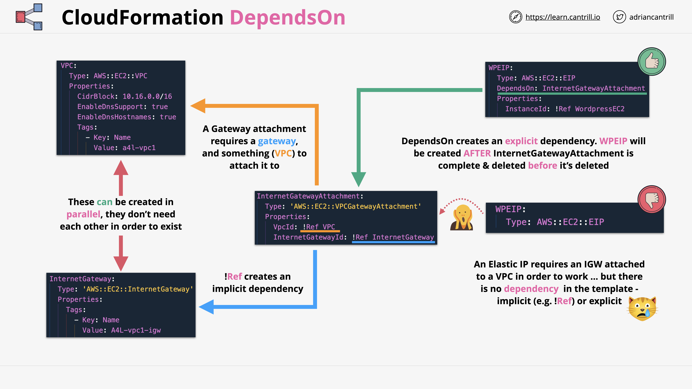

<h1 align="center"> SAA-C03 Notes (Dec 2024) </h1>
<div align="center"> I've put together these notes for the AWS Solutions Architect - Associate (SAA-C03) Exam using the course by Adrian Cantril because I couldn’t find any GitHub resources that fit what I was looking for. These notes provide a good balance, summarizing key points in a concise, easy-to-understand format that's perfect for quick review later.</div>

## Contribute

Contributions to the notes are welcome! If you find any errors or have updated notes, please do me a favor and open an issue or submit a pull request. Thanks! :relaxed:

## Table of Contents

1. [AWS Fundamentals](#aws-fundamentals)
2. [IAM, Accounts, and AWS Organizations](#iam-accounts-and-aws-organizations)
3. [Security, Identity, and Compliance](#simple-storage-service-s3)
4. [Virtual Private Clouds (VPC)](#virtual-private-cloud-vpc)
5. [Elastic Cloud Compute (EC2)](#elastic-cloud-compute-ec2)
6. [Containers and ECS](#containers-and-ecs)
7. [Advanced EC2](#advanced-ec2)
8. [Route 53](#route-53)
9. [Relational Database Service (RDS)](#relational-database-service-rds)
10. [Network Storage & Data Lifecycle](#network-storage-and-data-lifecycle)
11. [High Availability & Scaling](#high-availability-and-scaling)
12. [Serverless and Application Services](#serverless-and-application-services)
13. [Global Content Delivery (CDN) and Optimization](#global-content-delivery-cdn-and-optimization)
14. [Advanced VPC](#advanced-vpc)
15. [Hybrid Environments and Migration](#hybrid-environments-and-migration)
16. [Security, Deployment, and Operations](#security-deployment-and-operations)
17. [Infrastructure as Code (CloudFormation)](#infrastructure-as-code-cloudformation)
18. [NoSQL Databases](#nosql-databases)

# AWS Fundamentals

## 1.1 Public vs Private Services
- **Public Internet**: Zone for internet-based services (e.g., email, online games, streaming).
- **Private Internet**: Isolated VPCs accessible only via VPN or Direct Connect. Public internet access requires an Internet Gateway.
  - Example: On-premises systems accessing AWS resources via Direct Connect can still use Internet Gateway for public AWS services like S3.
- **AWS Public Zone**: Hosts public services like S3 but requires explicit permissions for access.

## 1.2 AWS Global Infrastructure
- **Regions**:
  - Fully deployed AWS infrastructure in areas like Ohio, Singapore, and London.
  - Key benefits: fault tolerance, compliance, performance optimization.
- **Edge Locations**:
  - Local distribution points for low-latency services (e.g., Netflix streaming from Brisbane via Sydney Edge).
- **Management and Resilience**:
  - Regions connect via high-speed networks.
  - **Global Services** (e.g., IAM) replicate across regions.
  - **Regional Services** (e.g., EC2) replicate across AZs but fail if the entire region is down.
  - **AZ-Specific Services** operate in a single AZ; fail if the AZ is down.

## 1.3 AWS Default VPC
- Default VPC per region with CIDR `172.31.0.0/16`. Default subnets provide public IPv4 addresses.
- Use custom VPCs for production due to greater flexibility.
  - Example: Default VPC's `/16` range can host multiple smaller `/20` subnets.

## 1.4 EC2 Basics
- **IaaS**: Provides virtual machines (instances).
  - Example: Web servers with specific CPU and memory.
- **Billing**: On-demand, based on CPU, memory, storage, and networking.
- **Instance States**:
  - **Running**: Uses CPU, memory, and networking.
  - **Stopped**: Retains data, no active resources.
  - **Terminated**: Data deleted, no charges.
- **AMI**: Snapshot for creating instances.
  - Region-specific; includes permissions, boot volume, and device mappings.

## 1.5 S3 Basics
> **Global Object Storage**: Resilient, accessible globally, region-specific data.
- **Objects**:
  - Key (name), Value (data), Metadata, Access Control.
  - File size: 0 bytes to 5 TB.
- **Buckets**:
  - Names must be globally unique.
  - Data resides in a single region unless explicitly moved.
  - Soft limit: 100 buckets/account; hard limit: 1000.

## 1.6 CloudFormation Basics
- Automates infrastructure using templates (YAML/JSON).
- Templates create/update stacks (living representations of resources).
  - Example: Deploying multi-tier web apps with a single template.

## 1.7 CloudWatch Basics
- **Monitoring**: Tracks metrics (e.g., CPU usage, disk I/O), logs, and events.
  - **Alarms**: Trigger actions like sending SNS notifications.
- **Dimensions**: Name-value pairs to separate data sources within a metric.

## 1.8 Shared Responsibility Model
- **AWS**: Responsible for cloud security (e.g., hardware, global infrastructure).
- **Customer**: Responsible for in-cloud security (e.g., data encryption, firewall configuration).

## 1.9 High Availability, Fault Tolerance, and Disaster Recovery
- **High Availability (HA)**: Ensures uptime (e.g., 99.9% = ~8.8 hours/year downtime).
- **Fault Tolerance (FT)**: Operates despite failures with redundancy.
- **Disaster Recovery (DR)**: Prepares for major failures with recovery plans.

## 1.10 Route53 Fundamentals
- **DNS as a Service**: Manages domain registration and zones (public/private).
  - Example: Hosting DNS records for a website.
- Globally resilient with fault tolerance across regions.

## 1.11 DNS Records
- **A/AAAA**: Maps host to IPv4/IPv6 addresses.
- **CNAME**: DNS alias for other records.
- **MX**: Mail server records with priority settings.
- **TXT**: Arbitrary text, often for domain verification.
- **TTL**: Specifies cache duration for DNS records.

## 1.12 DNS Root
- Managed by IANA; root servers guide DNS queries.
- **Root Hints**: Point to root servers for DNS resolution.

## 1.13 DNS Hierarchy
- Root zone delegates authority to TLDs (e.g., `.com`, `.org`).
- **Registry** manages zones for TLDs.
- **Registrar** facilitates domain registration under TLDs.

# IAM, Accounts, and AWS Organizations

## 2.1 IAM Identity Policies
- **Policy Components**:
  - **Effect**: Allow/Deny.
  - **Actions**: Operations like `s3:GetObject`.
  - **Resources**: Targeted via ARNs.
  - **Statement ID (SID)**: Optional description.
- Policy priority: Explicit Deny > Explicit Allow > Implicit Deny.

## 2.2 IAM Users and ARNs
- **IAM Users**: Provide long-term AWS access for individuals or apps.
  - Authentication via username/password or access keys.
- **ARNs**: Uniquely identify AWS resources.
  - Example: `arn:aws:s3:::mybucket/*` targets objects in a bucket.

## 2.3 IAM Groups
- Manage multiple users with shared permissions.
  - Example: DevOps team group with read/write S3 permissions.
- Benefits: Simplifies updates, centralized management.
- Limitations: Cannot reference groups in resource policies.

## 2.4 IAM Roles
> Provide temporary credentials for specific tasks.
  - Example: Granting developers temporary S3 access via an assumed role.
- **Trust Policy**: Who can assume the role.
- **Permission Policy**: Defines role actions.
- Temporary credentials expire and require reassumption.

## 2.5 When to Use IAM Roles
- **Lambda Execution Role**:
  - Use for functions with unknown number of principals.
  - Trust Policy: Trust Lambda Service.
  - Permission Policy: Grant AWS service access.
  - Uses `sts:AssumeRole` for temporary keys (e.g., CloudWatch, S3).
  - Prefer roles over direct policy attachment.

- **Emergency Situations (Break Glass)**:
  - Role for exceptional access needs.
  - Requires justification to "break the glass."
  - Grants expanded access when necessary.

- **Integrating AWS with Corporate Environment**:
  - Use IAM roles for Single Sign-On (SSO) with identity providers (e.g., Active Directory).
  - ID Federation allows external services to assume AWS roles.

- **Web Identity Federation**:
  - IAM Roles integrate with web identities (e.g., Google, Facebook, Twitter).
  - No AWS credentials stored in the app.
  - Scales for millions of users.
  - Grants trusted web identities access to AWS resources (e.g., DynamoDB).

- **Cross-Account Access**:
  - IAM Roles allow partner accounts to access or upload to AWS resources.

## 2.6 Service-linked Roles & Passrole
- **Service-linked Roles**:
  - IAM role that is linked to a specific AWS service which can be created/deleted by it (policy)
  - Provides permissions for service to interact with other services

- **Passrole**:
  - Allows users to pass an existing role to an AWS service

## 2.7. AWS Organizations
### Overview
> AWS Organizations centralize account management for multi-account environments. Without it, each account requires individual IAM users and payment methods. Useful for organizations managing 5+ accounts.

### Key Features:
- **Management/Master Account**: Primary account that creates and manages the organization.
- **Member Accounts**: Accounts that join the organization and delegate management to the master account.
- **Organization Root**: Container holding master and member accounts or organizational units (OUs).
- **Consolidated Billing**: Combines billing from member accounts into a single bill for the master account. Allows cost optimization via reservations and volume discounts.
- **Role Switching**: Enables switching between accounts using CLI or console.

### Creating Accounts in an Organization:
- Only an email address is required.
- IAM users in individual accounts can be replaced with IAM roles for centralized access.

## 2.8. Service Control Policies (SCPs)

### Overview
> SCPs restrict actions that member accounts can perform. They act as a "guardrail," not granting permissions but limiting what IAM policies can allow. Master accounts cannot be restricted by SCPs (security risk).

- **Only Overlaps Allowed**: Only allow rules in both the SCP **and** the IAM policy are granted. If a rule is missing in one or the other, the action is denied.

### Allow List vs Deny List:
1. **Deny List** (Default):
   - AWS applies `FullAWSAccess` SCP initially, allowing all actions.
   - Example: To deny all S3 access:
     ```json
     {
       "Effect": "Deny",
       "Action": "s3:*",
       "Resource": "*"
     }
     ```
   - Minimal administrative overhead.
2. **Allow List**:
   - Explicitly define allowed services. Example:
     ```json
     {
       "Effect": "Allow",
       "Action": ["s3:*", "ec2:*"],
       "Resource": "*"
     }
     ```

## 2.9. CloudWatch Logs

### Overview
- **Purpose**: Store, monitor, and analyze logging data.
- **Architecture**:
  - **Log Events**: Data points with a timestamp.
  - **Log Streams**: Sequences of log events from the same source.
  - **Log Groups**: Containers for related log streams with shared settings (e.g., retention, permissions).
  - **Metric Filters**: Generate metrics based on log data.
- Regional service integrated with CloudWatch.

## 2.10. CloudTrail Essentials

### Overview
Tracks API activity and user actions for auditing and compliance.

### Key Features:
1. **Event History**: Retains 90 days of management events for free.
2. **Trails**:
   - **Single-region** or **all-region** configurations.
   - Logs events to S3 or CloudWatch Logs.
3. **Management Events**: Logs resource management activities (e.g., creating EC2 instances).
4. **Data Events**: Logs object-level activities (e.g., S3 uploads). Must be enabled explicitly.
5. **Global Services** (e.g., IAM, CloudFront): Always log to `us-east-1`.

### Notes:
- Not real-time; ~15-minute delay.
- Pricing applies for additional trails, storage, and event data.

## 2.11. AWS Control Tower

### Overview
> Quick and easy setup of multi-account environments
- Orchestrates other AWS services to provide this functionality
- Organizations, IAM identity center, CloudFormation, Config and more
- **Landing Zone**: Centralized management for multi-account environments
  - SSO/ID Federation, Centralized logging and auditing
- **Guard Rails**: Detect/Mandate rules/standards across all accounts
  - Mandatory, Strongly Recommended, or Elective
- **Account Factory**: Automates and standardizes account creation

## Simple Storage Service (S3)

## 3.1. S3 Security

- **Private by Default**: Only the account root user has access initially.
- **Bucket Policy**: Manages access at the bucket level for cross-account or anonymous access.
  - Type of **Resource Policy**: like identity policy, but attached to bucket.
- **Access Control Lists (ACLs)**: Legacy feature; not recommended due to limitations.
- **Block Public Access**: Default setting that prevents access from public (fail-safe).

## 3.2. S3 Static Hosting

- Enables serving static websites directly from S3 via HTTP.
- Requires:
  - **Index Document**: Entry point (e.g., `index.html`).
  - **Error Document**: For error handling (e.g., `404.html`).
- Website Endpoint: Specific address that serves that page/content.
- Pricing: Costs based on storage (per GB/month), data transfer (per GB), and request rates (per 1k requests). Much cheaper than EC2 and other compute services.

## 3.3. Object Versioning and MFA Delete

- **Versioning**:
  - Retains previous versions of objects.
  - Once enabled, cannot be disabled (only suspended).
  - Delete marker hides versions without deleting them.
  - **ID**: Each object is given an ID if versioning is enabled.
- **MFA Delete**:
  - Adds MFA requirement for versioning changes or object deletions.

## 3.4. S3 Performance Optimization

1. **Multipart Uploads**:
   - For objects > 5GB, breaks data into parts for faster, fault-tolerant uploads.
   - Each part can be retried independently, reducing upload failures.

2. **S3 Accelerated Transfer**:
   - Uses AWS edge locations to improve transfer speed.
   - Ideal for large files and distant clients.

## 3.5. Key Management Service (KMS)

> **Purpose**: Manage encryption keys.
- Adheres to **FIPS 140-2 (L2)** compliance for AWS-managed keys.
- **KMS Keys**: Customer-owned keys used for cryptographic operations.
  - Logical - ID, date, policy, description & state.
  - Backed by physical key material.
  - Isolated to a single region & never leave.
  - AWS Owned or Customer Owned.
  - AWS Managed or Customer Managed.
- **Data Encryption Keys (DEKs)**:
  - Generated by KMS and used for encrypting large data.
  - KMS only stores encrypted DEKs, ensuring data security.

## 3.6. Encryption

### Types of Encryption:
1. **At Rest**: Protects stored data (e.g., disk encryption).
2. **In Transit**: Secures data during transfer (e.g., HTTPS).

**Symmetric Encryption**: Same key used for encryption and decryption.
**Asymmetric Encryption**: Two keys (public and private) used for encryption and decryption.
  - Public key: Can't decrypt data by can generate ciphertext.
  - Private key: Can decrypt data using public key.

### Terms
- plaintext: Unencrypted data not limited to text.
- ciphertext: Encrypted data generated by an algorithm from plaintext (e.g., AES).
- key: a password or code used to encrypt/decrypt data.

### Methods:
- **Client-Side Encryption**: Performed by the user before data reaches S3.
- **Server-Side Encryption (SSE)**:
  1. **SSE-C**: Customer-provided keys.
  2. **SSE-S3**: AWS-managed keys.
  3. **SSE-KMS**: Keys managed by AWS KMS, allowing role-based access.

## 3.7. S3 Storage Classes

1. **Standard**: High durability and availability; low latency.
  - Used for **frequently accessed data** that is important.
  - Replicated over 3 AZs.
  - **HTTP/1.1 200 OK** response is provided by S3 API Endpoint when objects are stored.
  - Billed GB/month fee for data stored, $ per GB for transfer out (in is free), and $ per 1000 requests.
2. **Standard-IA**: Lower cost for infrequent access.
  - Used for **long-lived data** which is important but not frequently accessed.
  - Same as Standard but with retrieval fee (per GB).
  - Minimum duration charge of 30 days.
3. **One Zone-IA**: Cost-effective for less critical data stored in one AZ.
  - Used for **long-lived data** that is not critical and not frequently accessed.
  - Stored only in 1 AZ.
4. **Glacier Instant**: Cheaper storage, more expensive retrieval, longer minimum.
  - Used for long-lived data accessed **once per quarter** with millisecond access.
5. **Glacier Flexible** Archival storage with retrieval times of minutes to hours.
  - Requires retrieval process: Expedited (1-5 minutes), Standard (3-5 hours), Bulk (5-12 hours).
6. **Glacier Deep Archive**: Cheapest option for long-term archival with retrieval in hours to days.
7. **Intelligent-Tiering**: Automatically moves objects between storage classes based on usage.


## 3.8. Object Lifecycle Management

- **Lifecycle configuration**: Set of rules consisting of actions on a bucket or group of objects.
  - Transition Actions and Expiration Actions
- Automates transitions between storage classes or object expiration.
  - Minimum of **30 days** before transition.
- Example:
  - Move to Standard-IA after 90 days.
  - Archive to Glacier after 1 year.

## 3.9. S3 Replication

1. **Cross-Region Replication (CRR)**:
   - Replicates objects between buckets in different regions.
2. **Same-Region Replication (SRR)**:
   - Replicates objects within the same region.
3. Within same account or between different accounts.
  - Need a bucket policy at destination account to allow Source Role to transfer.

### Key Notes:
- Requires versioning enabled on both buckets.
- Cannot replicate retroactively.
- Handles SSE-S3, SSE-KMS, and SSE-C.
- Source bucket owner needs permissions to objects.
- No system events, Glacier, or Glacier Deep Archive.

## 3.10. S3 Presigned URLs

> **Purpose**: Provide temporary access to S3 objects without sharing credentials.
- **Parameters**:
  - Security credentials.
  - Bucket and object key.
  - Expiry time.
- The permissions of the URL match the identity which generated it.

## 3.11. S3 Select and Glacier Select

- Retrieve specific parts of an object using SQL-like queries.
- Reduces data transfer and retrieval costs.

## 3.12. S3 Event Notifications

> Notification generated when events occur in a bucket
- Can be delivered to SQS, SNS, or Lambda.
- **Event Types**:
  - Object Created
  - Object Deleted
  - Object Restore
  - Object Replication

## 3.13. S3 Object Locks

> Store objects using a write-once-read-many (WORM) model.
- Prevent objects from being deleted or overwritten for a fixed amount of time or indefinitely.
- Requires versioning
- Retention period: days & years
- Architectures: Legal Hold, Governance, & Compliance
  - Compliance: Can't be adjusted, deleted, or overwritten.

## 3.14. S3 Access Points

> Simplify managing access to S3 buckets/objects.
- Create multiple access points for different use cases, policies, and network access controls.
- Created via Console or **aws s3control create-access-point** command.

# Virtual Private Cloud (VPC)

## 4.1. Networking Refresher

### IPv4 - RFC 791 (1981)
- Uses **dotted decimal notation**: 4 numbers (0-255) separated by periods.
- Total: **~4.3 billion addresses**.
- Limitation: Inflexible sizing; some addresses often go unused.

### Classful Addressing
- **Class A**: `0.0.0.0 - 127.255.255.255` (Large companies; 128 networks).
- **Class B**: `128.0.0.0 - 191.255.255.255` (Medium organizations).
- **Class C**: `192.0.0.0 - 223.255.255.255` (Small networks).

### Internet/Private IPs - RFC1918
- **Private IP ranges** (not internet-routable):
  - **Class A**: `10.0.0.0 - 10.255.255.255`
  - **Class B**: `172.16.0.0 - 172.31.255.255`
  - **Class C**: `192.168.0.0 - 192.168.255.255`

### Classless Inter-Domain Routing (CIDR)
- CIDR notation: `<network address>/<prefix>`.
  - **Example**: `10.0.0.0/16` (65,536 addresses).
  - Larger prefix = smaller network, e.g., `/20` splits `/16` into 16 subnets.

### Key IP Address Notations
- `0.0.0.0/0`: All IPs.
- `10.0.0.0/8`: All IPs starting with `10` (Class A).
- `10.0.0.0/16`: All IPs starting with `10.0` (Class B).
- `10.0.0.0/32`: Single IP address.

### Packets
- Contains:
  - **Source IP**
  - **Destination IP**
  - **Data**
- Uses protocols:
  - **TCP** (connection-oriented).
  - **UDP** (connectionless).
- Ports allow multiple concurrent communications.

### IPv6 - RFC 8200 (2017)
- Format: `2001:0db8:28ac::82ae:3910:7334`.
- Total: **128-bit** addresses (vastly larger than IPv4).
- CIDR notation applies, e.g., `2001:db8::/48` spans addresses `2001:db8:0000::` to `2001:db8:ffff::`.
- `::/0` covers all IPv6 addresses.

## 4.2. VPC Sizing and Structure

### VPC Considerations
- **Size**: Plan VPC size to avoid overlap with other VPCs or cloud networks.
- **Range**: Use uncommon ranges, e.g., `10.16.x.x`.
  - Min: `/28` (16 IPs).
  - Max: `/16` (65,536 IPs).
- Reserve ranges per region/account for scalability.

### Subnet Sizing
- Subnets are **AZ-specific**.
- Best practice: Use at least **4 AZs** with separate tiers (web, app, DB, spare).
- Example: Splitting `/16` into `/20` provides **16 subnets**.

## 4.3. Custom VPC

### Features
**Regionally isolated and resilient**.
- No inbound/outbound traffic without explicit configuration.
- **Hybrid Networking**: Connects on-prem/cloud environments.
- Tenancy options:
  - **Default**: Shared hardware.
  - **Dedicated**: Isolated hardware (higher cost).

### Key Facts
- **IPv4**: Mandatory CIDR block (min `/28`, max `/16`).
  - Can add up to **5 secondary CIDR blocks**.
- **IPv6**: Assigned `/56` CIDR (public by default).
- **DNS Support**: Provided by Route 53.
  - IP: `<VPC Base> + 2` (e.g., `10.0.0.2`).
  - Options:
    - **DNS Hostnames**: Assign public DNS to instances.
    - **DNS Resolution**: Enable VPC DNS access.

## 4.4. VPC Subnets

### Subnet Features
- **AZ-resilient**: Subnets fail if the AZ fails.
- IPv4 CIDRs: Cannot overlap within the VPC.
- IPv6: Optional allocation.
- **Communication**: Subnets in the same VPC communicate by default.

### Reserved IPs
- **5 reserved IPs** per subnet:
  1. Network address (e.g., `10.16.16.0`).
  2. VPC router (`10.16.16.1`).
  3. DNS (`10.16.16.2`).
  4. Future AWS use (`10.16.16.3`).
  5. Broadcast (`10.16.31.255`).

### DHCP Options Set
- Automates IP assignment.
- Cannot edit; create new set if changes are needed.

### IP Allocation
- **Public IPv4**: Enabled to make subnets public.
- **IPv6**: Requires subnet and VPC IPv6 allocations.

## 4.5. VPC Routing and Internet Gateway (IGW)

### VPC Router
> Moves traffic between subnets.
- Route tables define outbound traffic behavior.
  - Each subnet uses the **main route table** unless explicitly associated with a custom table.

### Route Tables
- Matches destination IPs against routes.
- **Local routes** (within VPC) cannot be modified and take precedence.

### Internet Gateway (IGW)
- **Enables external connectivity** for VPCs.
- **Regional service**: Covers all AZs in a region.
- Attach to VPC:
  - No IGW = private VPC.
  - One IGW = public VPC.
- Steps:
  1. Create IGW.
  2. Attach IGW to VPC.
  3. Create custom route table (RT).
  4. Associate RT.
  5. Default Routes => IGW.
  6. Subnet allocate IPv4.

### IGW Functionality
- **Private-to-Public Translation**: Maps private IPs to public IPs for external access.
- **IPv6**: Public by default; no translation needed.

### Bastion Host / Jumpbox
*Not recommended anymore*
- An instance in public subnet where incoming management connections arrive.
- Used as an inbound management point, or as an entry point for private-only VPCs.

## 4.6 Stateful vs Stateless Firewalls
- Every connection has a request and a response.
- Both can be in either direction inbound/outbound (based on perspective).
- **Stateless**: Doesn't understand state of connections.
  - Need 2 rules (1 IN, 1 OUT) per connection.
- **Stateful**: Can identify the request and response components of a connection as being related.
  - Allowing request means response is automatically allowed.

## 4.6. Network Access Control Lists (NACLs)

### Features
- **Stateless**: Separate inbound and outbound rules.
- **Subnet-level**: Filters traffic crossing subnet boundaries.
- Rules processed in order, lowest number first.
- Fields:
  - **Type**: Protocol (TCP/UDP/ICMP).
  - **Port Range**.
  - **Source/Destination**.
- Default implicit deny (`*`).

### Example
- Allow HTTPS (TCP/443) inbound.
- Add outbound ephemeral ports (`1024-65535`) for response traffic.

### Exam PowerUp
- Use NACLs for:
  - Explicit deny (e.g., blocking bad IPs).
  - Non-SG-compatible resources (e.g., NAT Gateways).

## 4.7. Security Groups (SGs)

### Features
- **Stateful**: Tracks inbound/outbound traffic automatically.
- **Resource-level**: Attached to ENIs (Elastic Network Interfaces), not instances or subnets.
- Default SG:
  - Allows all traffic within the group.
  - Implicit deny for everything else.
- **Logical referencing**: When you reference an SG from another SG, you're implicitly referencing any resources associated with that SG.

### Exam PowerUp
- Use SGs as the default for most configurations.
- Combine with NACLs for explicit deny scenarios.

## 4.8. Network Address Translation (NAT) Gateway

### Features
- Gives Private CIDR range **outgoing** internet access.
- **IP Masquerading**: Hides CIDR blocks behind one IP.
- **Elastic IPs**: Static public IPs.
- AZ-resilient but not region-resilient (deploy in multiple AZs for HA).

### Comparison
- **NAT Gateway**:
  - Managed service; scales up to **45 Gbps**.
  - No port forwarding or bastion host capabilities.
- **NAT Instance**:
  - On a EC2 Instance.
  - Customizable but single-point-of-failure.

### IPv6 Note
- NAT not required for IPv6; all IPv6 addresses are public.

# Elastic Cloud Compute (EC2)

## 5.1 Virtualization 101

### Server Configuration Without Virtualization
- **CPU Hardware**: Handles all computations.
- **Kernel**: Operates in privileged mode, interacts directly with hardware.
- **User Mode**: Runs applications, interacts with hardware via system calls.
  - Direct hardware interaction without system calls leads to errors/crashes.

### Types of Virtualization

- **Emulated Virtualization (Software Virtualization)**
  - **Host OS** includes a hypervisor (HV) that emulates hardware for guest OS.
  - HV performs binary translation for system calls.
  - Slower but no guest OS modification needed.

- **Para-Virtualization**
  - Guest OS is modified to make hypercalls instead of system calls.
  - Faster since binary translation is avoided.

- **Hardware-Assisted Virtualization**
  - Virtualization-aware hardware (CPU traps privileged instructions).
  - Input/output operations like disk I/O and network sharing are crucial.

- **SR-IOV (Single Root I/O Virtualization)**
  - Physical hardware presents multiple virtual interfaces for enhanced networking
  - Fastest I/O speed
  - Called "Enhanced Networking" in EC2

## 5.2 EC2 Architecture and Resilience

> Virtual machines (OS + Resources)
- Run on EC2 Hosts
- Good for:
  - Traditional OS+Application Computer
  - Long-running computer
  - Server style applications
  - Monolithic application stacks
  - Migrating application workloads

### EC2 Hosts and Tenancy
- **Shared**: Instances share hardware but are isolated.
- **Dedicated**: Hardware exclusive to a customer; instances from the same account can share it.
- **Dedicated Host**: Entire physical server is dedicated to a single customer.

### Availability Zone (AZ) Resilience
- Instances are tied to **one AZ**.
- Data and storage (e.g., EBS) are specific to the AZ.
- Relocation occurs on host failure but stays within the same AZ.

### EC2 Networking
- Instances are provisioned with **Elastic Network Interfaces (ENI)**, mapping to subnets in one AZ.
- Instances can have multiple ENIs, even across subnets, provided they remain in the same AZ.

## 5.3 EC2 Instance Types

- **General Purpose (A, T, M)**: Balanced CPU and memory for steady-state workloads.
- **Compute Optimized (C)**: High-performance computing, gaming, and scientific modeling.
- **Memory Optimized (R, X)**: Large in-memory datasets.
- **Accelerated Computing (P, G, F)**: GPUs, FPGAs.
- **Storage Optimized (H, I, D)**: High-speed storage for analytics and search workloads.


### Instance Naming Scheme
- **Example**: `R5dn.8xlarge`.
  - `R`: Instance family.
  - `5`: Generation (newest recommended).
  - `dn`: Capabilities (e.g., `d` = NVMe storage, `n` = network optimized).
  - `8xlarge`: Size (memory/CPU).

## 5.4 Storage Refresher

### Types of Storage
- **Direct (local) attached Storage**: Storage on the EC2 Host.
- **Network attached Storage**: Volumes delivered over the network (EBS).
- **Ephemeral Storage**: Temporary storage within the instance (EC2).
- **Persistent Storage**: Permanent storage - lives past the lifetime of instance (EBS).

### Categories of Storage
- **Block Storage**: Presented as raw volumes, mountable, bootable (e.g., EBS). 
  - Use cases: Virtual machine OS, databases.
  - Scalable only up to disk size, High throughput, Low latency.
- **File Storage**: Shared file systems, mountable, not bootable (e.g., EFS). 
  - Use cases: Web servers, file systems.
  - Scales dynamically, with moderate latency.
- **Object Storage**: Flat data storage, not mountable or bootable (e.g., S3). 
  - Use cases: Backups, data lakes, unstructure data.
  - Unlimited scalabness, variable latency.

### Storage Performance Metrics
- **IO Block Size**: Determines data segmentation.
- **IOPS**: Number of read/write operations per second.
- **Throughput**: Data transfer rate (MB/s).
  - **Formula**: Block Size × IOPS = Throughput.

## 5.5 Elastic Block Store (EBS)

### Key Features
> **Block Storage**: Raw disk allocations (volume).
- **AZ Resilient**: provides persistent block storage tied to **one AZ**.
- Data replication ensures high availability within the AZ.
- Snapshot (backup) into S3 for region-resilient backups.
- Four volume types:
  - **General Purpose SSD (gp2)**: Default for most workloads, 100 IOPS minimum.
    - Newer gp3: 3000 IOPS & 125MiB/s standard. 20% cheaper than gp2. Faster throughput.
  - **Provisioned IOPS SSD (io1/2)**: High IOPS, multi-attach support, up to 64,000 IOPS.
  - **Throughput-Optimized HDD (st1)**: High throughput for sequential workloads.
  - **Cold HDD (sc1)**: Cost-efficient, less frequently accessed data.

### Snapshots and Restores
- Incremental snapshots to S3 for region-resilient backups.
- **Lazy Restore**: Data restored in the background; immediate access triggers on-demand restore.
- **Fast Snapshot Restore (FSR)**: Enables instant restores, billed per snapshot and AZ.


## 5.6 Instance Store Volumes

- **Block Storage** devices
- Local ephemeral storage tied to an EC2 host.
- **ATTACHED AT LAUNCH ONLY**, can't be added later.
- **High performance** but data is lost when:
  - Instance is stopped or moved.
  - Hardware fails or undergoes maintenance.
- Only available at launch, included in instance cost.
- **More IOPS and throughput** than EBS.

## 5.7 EBS vs Instance Store

### Use Cases
- **EBS**: Persistent, reliable, and flexible storage.
  - Cheap = ST1 or SC1
  - Only up to 260,000 IOPs, even with RAID0 (combined EBS volumes).
- **Instance Store**: Temporary storage with high IOPS and throughput. Cost already included in instances.
  - Can do more than 260,000 IOPs.

## 5.8 EBS Snapshots, Restore, and Fast Snapshot Restore (FSR)

- **Snapshots**: backups of data consumed within EBS Volumes - **Stored on S3**.
- Incremental: first is a full copy of volume 'data', future are incremental.
- Can be used to migrate data to different availability zones in a region, or to different regions of AWS.
- **Snaps restore lazily** - fetched gradually.
- **FSR**: Enables instant restores, billed per snapshot and AZ. Up to 50 snaps per region.

## 5.9 EBS Encryption
- Provides at-rest encryption using **AES-256**.
- Managed by **AWS KMS** with unique Data Encryption Keys (DEKs) per volume.
- Each volume uses 1 unique DEK.
- Snapshots and future volumes inherit encryption from their source volumes.
- **Important**: Encryption is seamless, with no performance impact.

## 5.10 EC2 Network Interfaces, IPs, and DNS

### Elastic Network Interface (ENI)
- 1 Primary and multiple Secondary ENIs available.
  - Secondary ENIs: Can detach and move.
- **Properties**:
  - **Primary IPv4**: Static for the instance lifetime.
  - **Public IPv4**: Dynamic, assigned only in public subnets.
    - Assigned by IGW - OS never sees public IPv4.
  - **Security Groups**: Apply at the ENI level.
  - **Elastic IPs**: Can be assigned to private IPs for fixed public access.
    - Removed the public IPv4 and replaces with Elastic IP.
  - Public DNS = Private IP in VPC, Public IP everywhere else.

## 5.11 Amazon Machine Image (AMI)

### AMI Lifecycle
- **Create AMI**: Capture EC2 configurations (EBS snapshots, block device mappings).
- AMI Lifecycle:
  1) Launch
  2) Configure 
  3) Create Image
  4) Launch
- **Launch Instances**: Deploy identical instances based on AMI.
- **Permissions**: Control access (default: private).

### Exam Tips
- AMIs are **regional**; copy to other regions as needed.
- AMI Baking: creating an AMI from a configured instance + application.
- AMI can't be edited.
- Can be copied between regions.
- Billing applies for EBS snapshots associated with the AMI.

## 5.12 EC2 Purchase Options (Launch Types)

- **On-Demand**: No commitments, pay per second/hour.
- **Spot Instances**: Up to 90% discount, terminated when bid exceeds spot price.
- **Reserved Instances**: Up to 75% discount, commitment of 1 or 3 years.
- **Dedicated Hosts**: EC2 Host allocated to you in entiriety. Pay for Hosts, no instance charges.
  - Capacity management required.
  - Better for licensing requirements
- **Dedicated Instances**: You don't own or share host. Extra charges for instances, but dedicated hardware.

## 5.13 Scaling Options

### Vertical Scaling
- Increase instance size to handle more load (requires reboot).
- **Limitations**: Expensive and downtime during scaling.

### Horizontal Scaling
- Add instances with a load balancer.
- Requires application support or off-host sessions.
- **Benefits**:
  - Stateless applications: application doesn't care which instance it connects to.
  - No disruption during scaling.
  - Cost-efficient with smaller instances.

## 5.14 Instance Metadata

- Accessible via: `http://169.254.169.254/latest/meta-data/`.
- Contains details about the instance (e.g., IPs, user data).
- **Important**: Metadata access is not authenticated or encrypted.

# Containers and ECS

## 6.1 Intro to Containers

### Virtualization Problems
- Traditional EC2 VMs (e.g., 4 GB RAM, 40 GB disk with Nitro Hypervisor):
  - OS can consume **60-70% of the disk** and significant memory.
- **Containers** optimize resource usage by removing duplicate OS elements, allowing applications to run in isolated environments.

### Image Anatomy
- Docker images are built from **multiple independent layers**, not monolithic.
- Each layer corresponds to a line in the **Dockerfile**.
- **Images** are read-only, while **containers** add a read/write layer for execution.
- Shared architecture minimizes disk space usage across containers with similar base layers.

### Image Usage
- A **Docker image** becomes a running **Docker container** with a writable layer added.
- Base layers (OS) are often provided by vendors via **container registries** (e.g., Docker Hub).

### Container Registry
> **Container Registry**: Repository for storing and sharing container images (e.g., Docker Hub, AWS ECR).
- Workflow:
  1. Use a **Dockerfile** to create an image.
  2. Upload the image to a registry (private or public).
  3. Deploy containers to Docker hosts (running a container engine).

### Container Key Concepts
- **Dockerfile** builds container images.
- **Portability**: Containers run identically across compatible hosts.
- **Lightweight**: Uses host OS resources efficiently.
- **Shared Layers**: Reduces redundancy and disk usage.
- **Ports**: Expose for external communication.
- **Multi-Container Applications**: Supports complex application stacks.

## 6.2 Elastic Container Service (ECS) Concepts
> ECS is a **managed container-based compute service** for running containers.
- Operates in two modes:
  1. **EC2 mode**: Leverages EC2 instances for container orchestration.
  2. **Fargate mode**: Serverless, no EC2 management required.

### Key Components
- **Cluster**: Logical group where containers run.
  - Can span **multiple AZs** within a VPC.
- **Container Definition**:
  - Specifies image source, ports, and minimal container info.
- **Task Definition**:
  - Includes resources, task roles (IAM), and permissions for AWS services.
- **ECS Service**:
  - Configures scaling and high availability via service definitions (e.g., how many tasks to run).

## 6.3 ECS Cluster Types

### Scheduling and Orchestration
ECS manages:
- **Cluster Management**: Organizes resources.
- **Task Placement**: Determines where containers run.

### EC2 Mode
- **Cluster in a VPC**: Benefits from multi-AZ resilience.
- Requires managing EC2 instances (not serverless).
- Autoscaling Group (ASG): Control horizontal scaling of EC2 instances.
- **ECR**: Container registry for storing container images.
- Supports:
  - **Spot pricing** for cost-efficiency.
  - Prepaid EC2 for predictable costs.

### Fargate Mode
- **Serverless**: No EC2 management required.
- Tasks are injected into the VPC with **elastic network interfaces** and VPC IPs.
- Billing is based on **container resource usage**, not instance size.

### EC2 vs ECS (EC2) vs Fargate
- Use **ECS** for containerized workloads.
- **EC2 mode**:
  - Ideal for large workloads with cost sensitivity (supports spot pricing).
- **Fargate**:
  - Suitable for burst-style, batch, or periodic workloads.
  - Reduces operational overhead for small workloads.

## 6.4 Elastic Container Registry (ECR)

### Container Registry
> **Container Registry**: Repository for storing and sharing container images (e.g., Docker Hub, AWS ECR).
- Each AWS account has a public and private registry -> Each registry can have many repositories -> Each repository can have many images.
- Integrated with IAM for permissions
- Inspector: basic, and enhanced image scanning
- Metrics: real-time metrics with Cloudwatch (auth, push, pull, etc.)
- API Actions using Cloudtrail
- Events -> Eventbridge

## 6.5 Kubernetes 101

### Kubernetes
> **Kubernetes**: Container-orchestration platform for automating the deployment and scaling of containerized applications.
- Cluster: A deployment of Kubernetes, management, orchestration.
- Node: Resources; pods are placed on nodes to run.
- Pods: Smallest units of computing in Kubernetees. Pods are non-permanent.
- Service: Abstraction, service running on 1 or more pods.
- Job: Ad-hoc, creates one or more pods until completion.
- Ingress: Exposes a way into a service (Ingress => Routing => Service => 1+Pods).
- Ingress Controller: used to provide ingress (e.g. AWS LB Controller).
- Persistent Storage (PV) - Volumes

 

## 6.5 Elastic Kubernetes Service (EKS)

- AWS Managed Kubernetes Service - open source and cloud agnostic
- AWS, Outposts, EKS Anywhere, EKS Distro
- Runs on multiple AZs
- Integrates with AWS services (ECR, ELB, IAM, VPC)
- EKS Cluster: EKS Control Planes, and EKS Nodes
- Nodes - Self managed, managed node groups, or Fargate pods

# Advanced EC2

## 7.1 Bootstrapping EC2 Using User Data

> **Bootstrapping**: Automates the configuration of an EC2 instance during launch by running scripts or configuration steps passed as **user data**.

- **Process**:
  - User data is injected into the instance via the metadata IP: `http://169.254.169.254/latest/user-data`.
  - Executed once during the first launch.
  - Used for software installs and configurations.

**Key Points**:
- EC2 does not validate user data; the OS must understand it.
- User data size is limited to **16 KB**.
- User data can be modified by stopping, changing, and restarting the instance, but it won’t re-execute.

**Boot-Time-to-Service Optimization**:
- Use AMI baking for time-intensive tasks.
- Reserve bootstrapping for final configuration to reduce service readiness time.

## 7.2 AWS::CloudFormation::Init (cfn-init)

`cfn-init`: A helper script for EC2 instances, used for more advanced configuration management.

- Procedural (User Data) or desired state configurations (cfn-init).
  - E.g., installing specific package versions, managing OS users, and downloading files.
- Configuration data is passed via CloudFormation templates (`AWS::CloudFormation::Init`).

**CreationPolicy and Signals**:
- Ensures CloudFormation waits for instance provisioning before marking as complete.
- Timeout values can be set to prevent premature state changes.

## 7.3 EC2 Instance Roles

> **IAM Roles** for EC2 provide temporary, auto-rotated credentials via the metadata service:

- Credentials path: `iam/security-credentials/<role-name>`.
- Best practice: Use IAM roles instead of storing credentials on instances.
- Automatically integrated with AWS CLI and SDKs.

**Instance Profile**:
- Links roles to EC2 instances.
- Created automatically when roles are added via the console.

## 7.4 SSM Parameter Store

> **Parameter Store** securely stores configuration and secrets (e.g., database strings, passwords):

- Parameter types: Strings, stringlist, and secure strings.
- Supports plaintext and encrypted strings (via KMS).
- Features:
  - Hierarchies and versioning.
  - Public parameters (e.g., latest AMI IDs).
  - Accessible via IAM roles.

## 7.5 System and Application Logging on EC2

**CloudWatch Agent**:
- Required to capture instance-level OS logs for **CloudWatch Logs**.
- Configuration stored in **Parameter Store**.

**IAM Role**:
- Provides permissions for the CloudWatch Agent to interact with AWS services.

**Log Architecture**:
- Log groups: Represent individual log types.
- Log streams: Separate logs per instance.

## 7.6 EC2 Placement Groups

### Cluster Placement
- Instances are physically close for maximum performance.
- Use cases: High-speed networking (e.g., **10 Gbps single stream**), low latency.
- Limitations:
  - Single AZ only.
  - Hardware failure impacts all instances.
- Best practice: Launch all instances at once.

### Spread Placement
- Instances are separated for high availability.
- Use cases: Critical applications requiring resilience.
- Key points:
  - Maximum of **7 instances per AZ**.
  - Supported across multiple AZs.

### Partition Placement
- Instances are grouped but separated across partitions.
- Use cases: Distributed systems like HDFS, Cassandra.
- Key points:
  - **7 partitions per AZ**.
  - Instances can be assigned to specific partitions or auto-placed by AWS.

## 7.7 EC2 Dedicated Hosts

Dedicated Hosts allocate physical servers exclusively to your account:

- **Use cases**: License management and compliance.
- Pricing: On-demand or reserved (1 or 3 years).
- Limitations:
  - Some AMIs may not be compatible.
  - Does not support RDS or placement groups.

## 7.8 Enhanced Networking

**Enhanced Networking**:
- Uses **SR-IOV** for direct hardware access.
- Benefits:
  - Higher bandwidth and packets-per-second.
  - Lower latency and reduced CPU usage.

**EBS Optimization**:
- Provides dedicated bandwidth for storage networking.
- Enabled by default on most new instance types at no extra cost.

# Route-53

- Note: Routing policies listed at the bottom of this section.

## 8.1. Public Hosted Zones
A hosted zone is a DNS database for a given section of global DNS data.
> **Public hosted zones** are hosted on Route 53’s public DNS name servers.
- AWS provides at least **4 DNS name servers** for each hosted zone.
- Globally resilient service due to multiple DNS servers.

### Features
- Automatically created when you register a domain with Route 53.
- Can also be created separately for domains registered elsewhere.
- Fee structure includes:
  - **Monthly fee per hosted zone**.
  - **Query charges**.

### Key Points
- Hosted zones are authoritative for their domain, serving as the **single source of truth**.
- VPC instances use the **VPC +2 address**(R53 Resolver) as their DNS resolver to query Route 53 public and internet-hosted DNS zones.

## 8.2. Private Hosted Zones

- Similar to public hosted zones but restricted to associated VPCs.
- Accessible only within those VPCs via the Route 53 resolver.

### Split-View DNS
- Public and private hosted zones can share the same domain name.
- **Use case**: Public hosted zone contains records accessible from the internet, while private hosted zone includes internal records for VPC use.

## 8.3. CNAME vs ALIAS

- **CNAME**: Maps a NAME to another NAME.
  - `www.catagram.io` maps to `catagram.io`.
  - Invalid for naked/apex records.
- **ALIAS**: Maps a name or an AWS record.
  - Can be used both for naked/apex and normal records.
  - No charge for ALIAS requests.
  - **DEFAULT** option for AWS services.

## 8.4. Route 53 Health Checks

- Health checks allow periodic monitoring of servers and resources.
- Unhealthy servers are automatically removed; healthy ones are re-added.

### Features
- **Independent of DNS records** but utilized by them.
- Performed by a fleet of global health checkers.
  - **Blocking checkers as bots may cause alarms**.

### Check Types
1. **TCP Checks**:
   - Verifies TCP connection establishment within 10 or 30 seconds.
2. **HTTP/HTTPS Checks**:
   - Confirms a **200/300 status code** response within 3 seconds.
3. **HTTP/HTTPS String Matching**:
   - Validates the presence of a specific string in the body (first 5120 bytes).

### Health Check Categories
- **Endpoint Checks**: Directly monitor resource health.
- **CloudWatch Alarms**: Trigger actions based on custom metrics.
- **Calculated Checks**: Aggregate multiple checks.

### Frequency
- Default: Every **30 seconds**.
- Optional: **10-second checks** (higher cost).

## 8.5. Route 53 Routing Policies

1. **Simple Routing**:
   - Routes traffic to a single resource.
   - No health checks.
   - Client receives a random response from available values.

2. **Failover Routing**:
   - Two records: **Primary** and **Secondary**.
   - Uses health checks to implement active-passive failover.
   - If primary fails, secondary is used.

3. **Multi-Value Routing**:
   - Similar to simple routing but incorporates health checks. Combination of Simple Routing and Failover Routing.
   - Responds with all healthy records, removing unhealthy ones.
   - **Use case**: Reliability improvement and lightweight alternative to failover.

4. **Weighted Routing**:
   - Multiple records of the same name with assigned weights.
   - Distributes traffic based on weights.
   - Skips unhealthy records.
   - **Use case**: Gradual migrations or traffic distribution.

5. **Latency-Based Routing**:
   - Directs traffic to the region with the lowest latency for the user.
   - Multiple records of the same name and type.

6. **Geolocation Routing**:
   - Matches queries based on:
     1. **State**
     2. **Country**.
     3. **Continent**.
     4. **Default** (if no specific match).
   - **NOT about closest record or proximity.** It retuns relevant locations only! Route traffic based on location of customers.
   - **Use case**: Licensing or region-specific responses.
   - Overlapping regions prioritize the most specific match.

7. **Geoproximity Routing**:
   - Routes traffic based on geographic location and your resources.
   - Similar to Latency-based, but is based **distance** instead of latency.
   - **Bias**: Expands or shrinks the size of a geographic region from which traffic is routed to a specific resource.

## 8.6. Route 53 Interoperability

- Route 53 can be used as both **Domain Registrar** and **Domain Hosting**, but they both function **independently**.
- As a hoster:
  1) Allocates 4 name servers (NS)
  2) Creates a zone file on the above NS
- As a registrar:
  1) Accepts your money
  2) Communicates with registry of TLD
  3) Sets NS records for domain to point at the 4 NS

## 8.7. DNSSEC with Route53

> DNSSEC: Strengthens authentication in DNS using digital signatures based on public key cryptography.
- "Adds a layer of security by enabling authenticated answers on top of an otherwise insecure protocol. Whereas HTTPS encrypts traffic so nobody on the wire can snoop on your Internet activities, DNSSEC merely signs responses so that forgeries are detectable." - Cloudflare

# Relational Database Service (RDS)

## 9.1. Database Refresher

### Relational (SQL)

- SQL databases use **schemas** to define structured data with predefined relationships.
  - Schema specifies names, valid values, and data types.
- Tables include:
  - **Primary keys**: Unique identifiers for every row in each table.
  - Relationships between tables defined by **foreign keys** and **join tables**. 
- Relationships must be defined in advance, which can be challenging.

### Non-Relational (NoSQL)

- NoSQL databases often lack a fixed schema or have a weak one.

**Key-Value Databases**

- Stores data as unique key-value pairs.
- Highly scalable and fast; ideal for **in-memory caching**.

**Wide Column Store**

- Example: DynamoDB.
- Uses **partition keys** and optional **sort keys**.
- Attributes can vary by item but must have unique keys.

**Document Databases**

- Stores data in JSON or XML format.
- Suitable for nested data structures, e.g., user profiles.

**Row Databases (MySQL)**

- Optimized for transactional operations (OLTP).
- Best for frequent row-based queries.

**Column Databases (Redshift)**

- Stores data by columns, ideal for analytics and reporting.

**Graph Databases (AWS Neptune)**

- Nodes represent entities, and edges define relationships.
- Excellent for relationship-driven data like social networks.

## 9.2. ACID vs BASE

- **CAP Theorem**: Consistency, Availability, and Partition Tolerance
  - Consistency: Every read will receive the most recent write.
  - Availability: Every request will receive a non-error response.
  - Partition Tolerance: System will continue to operate even if there are dropped messages or errors.
  - Any database is capable of delivering only 2 of these.

- **ACID**: Focuses on Consistency. Used by Financial Institutions.
  - RDS databases
  - **A**tomicity: All or None components of transaction are executed.
  - **C**onsistency: Databases only moves from one valid state to another.
  - **I**solation: Transactions don't interfere with each other.
  - **D**urability: Transactions stay committed even if system fails.
  
- **BASE**: Focuses on Availability
  - NoSQL databases like DynamoDB
  - **B**asically **A**vailable: Read and Write operations available as much as possible.
  - **S**oft state: Database doesn't enforce consistency, it's offloaded to application.
  - **E**ventually Consistent: Consistency will eventually happen, if we wait long enough.
  - Advantage: High scalable and high performance.

## 9.3. Databases on EC2

*Generally considered bad practice in AWS*

### Reasons for EC2 Databases

- Need OS-level access for advanced configurations.
- Unsupported database types or versions on RDS.

### Drawbacks of EC2 Databases

- High **administrative overhead** and disaster recovery complexity.
- Limited to one AZ; prone to failures.
- Miss out on RDS features like automated scaling and replication.

## 9.3. Relational Database Service (RDS)

> Managed **Database-Server-as-a-Service (DBSaaS)** for engines like MySQL, PostgreSQL, Oracle, and SQL Server.
- Multiple databases on one DB server (instance).
- Dedicated storage per instance provided by EBS.
- Can use read-replicas to different regions for HA.
- Backups & Snapshots can be made to S3.
- Costs based on instance size/type, multi-az, storage type, data transferred, backups, and licensing.
- Instance types:
  - **General** (e.g., `db.m5`), **Memory-optimized** (e.g., `db.r5`), and **Burst** (e.g., `db.t3`).
- Storage options: SSD (`io1`, `gp2`) or magnetic.

## 9.4. RDS Multi-AZ (High Availability)

**Multi-AZ - Instance**
- Standby replica in a different AZ with **synchronous replication**.
- Failover (replica becomes primary) within 60-120 seconds during a primary instance failure.
- Backups occur on standby replicas to minimize performance impact.
- Only 1 standby replica.

**Multi-AZ - Cluster**
- **1 Writer** synchronously replicates to **2 Readers** in different AZs.
- Compared to standby in Instance mode, readers are usable.
- Writer can do **write** and **read**. Readers can only be used for **read-only** operations.
- Failover is faster (~35s) as replication is done via transaction logs.
- Cluster endpoint points at the writer.
- Reader endpoint directs reads to any available reader OR writer.
- Instance endpoint point to a specific instance (usually for testing).

## 9.5. RDS Backup and Restores

- Two types of backups: Automated Backups and Snapshots.
  - Both stored in AWS-managed S3 (*NOT VISIBLE TO USER*).
- **Snapshots** take a full copy of the database.
  - First snapshot is full; subsequent snapshots are incremental.
  - Snapshot don't expire, live on past the RDS instance.
- **Automated Backups**: basically automated snapshots.
  - Occur during a backup window.
  - Transaction logs saved every 5 minutes enable point-in-time recovery.
  - Automatically cleared by RDS. Retention b.w. 0 to 35 days.
- RDS can be configured to replicate backups to other regions.
- **Recovery Point Objective (RPO):** Max allowable data loss.
- **Recovery Time Objective (RTO):** Time to full recovery after failure.
- Restores create new RDS instances.
  - Snapshots - single point in time.
  - Automated Backups - any 5 minute point in time.

## 9.6. RDS Read-Replicas

>Uses **asynchronous replication** for scaling reads and global resilience.
- Data written to primary first, then to replicas.
- Compared to Multi-AZ Cluster, Read-Replicas aren't part of main database instance.
  - Have their own endpoints.
- Up to 5 replicas per database instance.
- Supports cross-region replication.
- Can promote replicas for write operations during failure.
- Compared to Snapshots & Backups, Read-Replicas have much better RPO and RTO. 

## 9.7. RDS Security

### Encryption
- Supports EBS volume encryption via KMS.
- Data keys used for encryption operations - AWS or Customer Manager CMK.
- Storage, snapshots, and replicas can be all encrypted, but it cannot be removed once added.
- **Transparent Data Encryption (TDE)**: Data encrypted within DB engine, not host.
- RDS Oracle supports CloudHSM (customer managed keys, hidden to AWS).

### IAM Authentication
- RDS Local DB account can be configured to use AWS Authentication Token.
- Policies attached to Users or Roles can be used to `generate-db-auth-token`.
  - Token has 15min validity & can be used in place of DB User Password.
- Note: Authentication ONLY, NOT Authorization.

## 9.8. RDS Custom

- Fills the gap b.w. RDS and EC2 running a DB engine.
- Works for MS SQL & Oracle
- Can connect using SSH, RDP, Session Manager
- Can configure; scaling, HA, backups, DB patches, OS patches, & OS install.

## 9.9. Amazon Aurora

*Very different from RDS*

> High-performance relational database with:
- 1 **Primary** and up to **15 Replica** DB instances.
- **Cluster architecture**: Shared SSD-based storage (up to 64 TiB) and 6 replica storage nodes.
- Automatic replication across multiple AZs.
- Faster provisioning and improved availability.
- Separate storage layer for data.
- Only primary instance can write to storage.

**Aurora Endpoints**

- **Cluster Endpoint**: Points to primary instance for reads and writes.
- **Reader Endpoint**: Load balances read replicas.

**Costs**

- No free-tier option.
- Compute billed per second; storage billed at high watermark (GB-Month).
- Free backups up to database size.

**Restore, Clone, and Backtrack**

- Restores create a new cluster.
- **Backtrack**: Roll back to a previous state.
- **Fast Clones**: Efficient storage sharing with minimal overhead.

## 9.10. Aurora Serverless

- Automatically scales with demand using **Aurora Capacity Units (ACUs)**.
- Users don't connect directly to the DB instances, but to a proxy instance.
- Ideal for new, unpredictable, or infrequent workloads.
- Billed per second for resources used, instead of instances provisioned.

## 9.11. Aurora Global Database

> Replicates data across up to 5 secondary regions with 16 replicas each.
- Storage-level replication ensures low latency (~1 second).
- Enhances disaster recovery and global read scaling.

## 9.12. Aurora Multi-Master Writes

- Supports multiple read/write nodes in a cluster.
- Ensures high availability with fast failover.

## 9.13. RDS Proxy

> Fully managed, highly available database proxy for RDS.
- Instead of applications connecting directly to DB, they connect to the proxy.
  - **Application(s) => Proxy (connection pooling) => Database**.
  - Much quicker to establish vs direct DB connection.
- Proxy maintains long-term Connection Pool with DB instances.
- Only accessible from a VPC and via Proxy Endpoint.
- Use cases:
  - Too many connection errors
  - AWS Lambda
  - Long running apps

## 9.14. Database Migration Service (DMS)

> AWS managed service for migrating databases.
- Replication instance performs migration b.w. Source and Destination endpoints
  - One endpoint MUST be on AWS.
- Supports **Full-load** (one-off migration of all data), **Full-load + Change Data Capture (CDC)**, and **CDC-only** migrations.
- Schema Conversion Tool (SCT) aids in cross-engine migrations.
  - Converting one DB engine to another.
  - Not used between DBs of same type.
  - Use with AWS Snowball for physical migration of extremely large data.

# Network Storage and Data Lifecycle

## 10.1. Elastic File System (EFS) Architecture

> AWS managed implementation of **Network File System (NFS)** which allows for the creation of shared 'filesystems' which can be mounted within multi-EC2 instances.
> -EFS enables instances to operate closer to a stateless architecture by providing shared file storage.

- **Protocol**: Implements **NFSv4**.
- **File System**: Created and mounted on Linux systems.
- **Storage Separation**: Operates independently of EC2 instances.
  - **EBS**: Block storage for single-instance use.
  - **EFS**: File storage for shared access.
- **Shared Access**: Supports multiple EC2 instances.
- **Private Service**: Isolated to the provisioned VPC.
  - Accessible through **mount targets** within the VPC.
- **External Access**: Can be accessed from on-premises.
  - VPC peering.
  - VPN connections.
  - AWS Direct Connect.

- Operates within a VPC with file systems using **POSIX** permissions.
- **Mount Targets**:
  - Provisioned with IP addresses from the subnet's range.
  - For high availability, deploy mount targets across all relevant AZs.
- Hybrid networking can connect external systems to the same mount targets.

## 10.2. Key EFS Features

- **Linux Only**: EFS supports Linux-based systems.
- **Performance Modes**:
  - **General Purpose**:
    - Optimized for latency-sensitive applications.
    - Default mode for most use cases.
  - **Max I/O**:
    - Designed for high aggregate throughput and IOPS.
    - May introduce higher latencies.
- **Throughput Modes**:
  - **Bursting**:
    - Functions like GP2 EBS volumes with performance tied to stored data.
  - **Provisioned Throughput**:
    - Allows specifying throughput requirements independently of storage size.
- **Storage Classes**:
  - **Standard**: For frequently accessed data. Default.
  - **Infrequent Access**: Lower-cost storage for rarely accessed data.
  - Lifecycle policies enable automatic data transitions between classes.

## 10.3. AWS Backup

  - Fully managed data-protection (back/restore) service.
  - Consolidate management into one place ..across accounts and regions.
  - Supports various AWS products: Compute, Block storage, File storage, Databases, and Object Storage.
  - Backup plans - frequency, windows, lifecycle, vault, region copy.
  - Vaults: backup destination (container)
    - **Vault lock**: write-one, read-many (WORM), 72hr cool-off
  - On-Demand backups with Point-in-time recovery.

# High Availability and Scaling

## 11.1. Regional & Global AWS Architecture

Global Architecture: Service location & discovery, content delivery (CDN), health checks & failover.
- CDNs (such as CloudFront) cache content gobally to improve performance.

Regional Architecture: Entry points, scaling & resilience, application services and components.
- At this level, environments will have various tiers for applications:
  - **Web Tier**: Entry point for regional-based applications.
    - Application Load Balancer (ALB), API Gateway, etc.
  - **Compute Tier**: Compute services fetches through Web Tier.
    - EC2, Lambda, Containers (ECS).
  - **Storage Tier**: Storage services used by Compute.
    - EBS, EFS, S3.
  - **Data Tier**: Data services used by various tiers.
    - RDS, DynamoDB, Aurora.
    - Typically accessed via **Caching layer** (ElastiCache, DynamoDB Accelerator).
  - **App Services Tier**: Other services that provide functionality for apps.
    - Kinesis, Step Functions, SQS, SNS, etc.

## 11.2. Evolution of Elastic Load Balancer (ELB)

Using a single server can lead to performance issues or downtime. Multiple servers solve this but introduce challenges:
- Uneven load distribution.
- Failed instances may still appear in DNS cache due to TTL values.

Three types of load balancers (ELB) within AWS between v1 and v2:
- *Classic Load Balancer (CLB)* was the first AWS load balancer - v1 - introduced in 2009.
  - Not really layer 7, lacking features.
- **Application Load Balancer (ALB)** - v2.
  - HTTP/S/WebSocket.
- **Network Load Balancer (NLB)** - v2.
  - TCP, TLS, UDP.
  - Ex: Email servers, or SSH servers.

V2 balancers are faster, cheaper, support target groups, and rules.

## 11.3. Elastic Load Balancer Architecture

> Load balancers: Accept connections & requests from users and distribute them to backend services.
- Choose **IPv4** or **Dual stack (IPv4 and IPv6)**.
- Select **1 subnet** in 2 or more AZs to place Load Balancer (ELB) Nodes.
  - 1 Node in each AZ.

### Internet-facing (public) ELBs
- Internet-facing ELB can connect to both public and private instances.
- Each ELB is configured with 'A' record DNS name which resolves to ELB Nodes.
- Need **8+ free IPs** per subnet; **/27** or larger to scale.

### Internal (private) ELBs
- Internal ELB can connect to private instances only.
- Used to allow scaling between application tiers (web, computer, db).
- ELBs can be placed b.w. tiers in combination with Auto Scaling Groups (ASG).
  - Decouple the tiers to operate and scale independently.

### Cross-Zone Load Balancing
- Ensures even distribution equally across instances in different AZs.
- Targets are grouped in **target groups**, and routing rules direct traffic to these groups.

### Key points:
- ELB is a DNS 'A' record pointing at 1+ nodes per AZ.
- Nodes (in 1 subnet per AZ) can scale.
- Two types: Internet-facing, and Internal.
  - Internet-facing: Connects to **BOTH public AND private** instances.
  - Internal: Connects to private instances.
- Instances don't need to be public to work with ELB.
- Listener Configuration controls WHAT the LB does.
- **8+ free IPs** per subnet; **/27** or larger to scale.

## 11.4. Application Load Balancer (ALB) vs Network Load Balancer (NLB)

CLBs (v1) dont scale. Every unique HTTPS name requires individual CLB (1 SSL per CLB).\
V2 load balancers support rules and **target groups**.
- Host based rules using SNI and an ALB allows consolidation (1 SSL per rule).

### Application Load Balancer (ALB)

**ALB** operates at Layer 7 (Application Layer) of the OSI model. 
- It can only inspect HTTP/HTTPS traffic and make routing decisions based on paths, headers, or hosts.
- L7 content type, cookies, custom headers, user location, and app behaviour.
- ALBs must have SSL certs if HTTPS is used.
- ALBs are slower than NLBs.
- Health checks evaluate application health (layer 7).
- Billing based on hourly rate and **Load Balancer Capacity Unit (LCU)** usage.

ALB Rules:
- Rules direct connections which arrive at a listener.
- Processed in priority order.
- Default rule = catchall.
- Rule conditions: host-header, http-header, http-request-method, path-pattern, query-string, source-ip.
- Actions: forward, redirect, fixed-response, authenticate-cognito, authenticate-oidc.

### Network Load Balancer (NLB)

**NLB** operates at Layer 4 (Transport Layer) of the OSI model.
- TCP, TLS, UDP, TCPs_UDP.
- No visibility or understanding of HTTP/HTTPS.
- No headers, no cookies, no session stickiness.
- VERY Fast (must faster than ALBs). Good for SSH, Financial apps, Game servers, etc.
- Health checks aren't app aware, just check ICMP/TCP handshake.
- For unbroken encryption, can use NLBs to forward TCP instances.

### ALB VS NLB (Exam Tips)

- Unbroken encryption  => Use NLB.
- Static IP for whitelist => Use NLB.
- Fastest performance => Use NLB.
- Protocols not HTTP or HTTPs => Use NLB.
- Privatelink => Use NLB.
- Otherwise => Use ALB.

## 11.5. Launch Configuration and Templates

Define instance configurations in advance:
- Includes AMIs, instance types, storage, security groups, and IAM roles.
- **Launch Templates (LTs)** are preferred over **Launch Configurations (LCs)** due to added features like versioning and T2/T3 unlimited.
- Both are immutable; changes require creating a new version.
- Used by Auto Scaling Groups (ASG) to configure instances to launch.
- Launch Templates can be used to directly create EC2 instances from console UI/CLI.

## 11.6. Autoscaling Groups (ASG)

> Enable automatic scaling and self-healing for EC2 instances. ASGs use LCs or LTs to provision instances and maintain a specified capacity.
- Have a **Minimum, Desired, and Maximum** size. For ex. 1:2:4 means 1 min, 2 desired, 4 max.
- ASG keeps running instances to the desired capacity by provisioning or terminating instances.
- *FREE*. Only billed for created resources.
- Granularity: more, smaller instances.
- **Cooldown Period** prevents excessive scaling actions.
- **Self-healing**: If EC2 instance fails, it passes info to ASG, which terminates instance and provisions a new one.
- ASG defines **when and where**, while LTs define **what**.

### Scaling Policies
Defined rules which can adjust values for ASGs:
1. **Manual Scaling**: Adjust desired capacity manually.
2. **Scheduled Scaling**: Predefined time-based scaling.
3. **Dynamic Scaling**: Simple, Step, and Target scaling.

### Dynamic Scaling
**Simple**: Add/remove instances based on a single metric.
- For ex. If CPU exceeds 50%, add an instance.
**Step**: Adjust based on predefined thresholds. 
- For ex. If CPU b.w. 50-60%, add 1 instance. If between 60-80%, add 2 instances. etc.
**Target**: Maintain a target metric value.
- For ex. Maintain target of 60% CPU utilization on average, add or remove instances as needed.

### ASG + Load Balancers
- ASGs can be connected to ELBs to make application more elastic.
- ASG Instances can be automatically added to or removed from target groups of ELBs.
- ASG can use load balancer health checks rather than EC2 status checks for App Awareness.

### Scaling Processes
- Launch and Terminate - suspend and resume.
- AddToLoadBalancer - add to LB on launch.
- AlarmNotification - accept notification from CW.
- AZRebalance - balances instances across AZs.
- HealthCheck - check health of instances.
- ReplaceUnhealthy - replace unhealthy instances.
- ScheduledActions - schedule on/off.
- Standby - for instances to standby.

### ASG Lifecycle Hooks
> Enable you to perform custom actions by pausing instances as an ASG launches or terminates them.
- Instances are paused within the flow until:
  - A timeout (1 hour by default).
  - CompleteLifecycleAction command.
- Use case: Load, Index, or Backup data.

### ASG Health Checks
**EC2 Health Checks** (Default): Check EC2 instance status.
- Unhealthy: Stopping, stopped, terminated, shutting down, or impaired (not 2/2 status).
**ELB Health Checks**: Check ELB status.
- ALBs can provide Layer 7 (HTTP/HTTPS) status checks.
**Custom Health Checks**: Instances marked healthy or unhealthy by external system.
- Health check grace period (Default 300s): Delay before starting checks.

## 11.7. SSL Offload and Session Stickiness
### SSL Modes
1. **Bridging**: Load balancer decrypts and re-encrypts traffic between clients and servers. Allows inspection of HTTP data.
2. **Pass-through**: Traffic remains encrypted end-to-end. Load balancer (NLB) does not require SSL certificates.
3. **Offload**: Load balancer decrypts traffic; backend servers handle plain HTTP traffic. Simplifies server configurations but sends unencrypted data internally.

### Session Stickiness
Ensures requests from the same client are routed to the same server.
- ALBs generate cookies for stickiness with durations of 1 second to 7 days.
- Stickiness can cause uneven backend loads; storing session data externally (e.g., DynamoDB) is recommended for stateless instances.

## 11.8. Gateway Load Balancer (GWLB)

> Help you run and scale 3rd party appliances.
- Deploy, scale, and manage firewalls, intrusion detection and prevention systems, and deep packet inspection systems
- Transparent inspection and protection of Inbound and Outbound traffic.
- GWLB endpoints: traffic enters/leaves via these endpoints.
- GWLB balances across multiple backend appliances.

# Serverless and Application Services

## 12.1. Architecture Evolution

### Monolithic Architecture

- Single entity with all components tightly integrated.
- System-wide failures occur if one component fails.
- Scaling is tied to the entire system, requiring all components to run on the same hardware.
- High operational costs due to always-on components.

### Tiered Architecture
- Components distributed across servers with load balancers for scalability.
 - Components can be scaled independently. For ex. with Load Balancers and ASGs.
- Tiers still remain coupled, where failure in one affects others.
- Responses/communication must be operational even if no meaningful processing occurs.

### Evolving with Queues
- Data processed asynchronously using queues.
- Uploads added to a queue with autoscaling for capacity as needed.
- Queue ensures decoupling between upload and processing tiers.
- Processing tier fetches data from queues rather than directly from upload tier.

### Microservices Architecture
- Independent microservices with distinct logic and data stores.
- Producers generate data; consumers process data.
- Communication via events and queues ensures decoupling.

### Event-Driven Architecture
- Producers generate events when something happens (e.g., clicks, errors).
- Consumers react to events, taking actions only when events occur.
- **Event Router** and Event Bus ensure efficient delivery and resource utilization.
- Resources are consumed only during event handling, enabling serverless operations.

## 12.2. AWS Lambda

> Function-as-a-Service (FaaS) that executes code in response to events - short running and focused.
> - Lambda function - a piece of code lambda runs.
> - Runs in runtime environments (eg. Python 3.8) with billing based on execution duration.
> - A key part of Serverless architecture.

### Lambda Architecture
Lambda function = Unit of configuration. Package of Code + Configurations.\
When Lambda function is invoked, deployment package is downloaded and executed in a runtime environment.\
Common Runtimes: Python, Ruby, Java, Go, C#.\
Runtime environments are allocated w/ certain amount of memory and CPU.
- vCPU allocated indirectly based on memory used.

Note: Docker ≠ Lambda

Lambda functions are **stateless**; no data is left from a previous invocation.
- Stateless design requires external data storage (e.g., DynamoDB, S3).

**Function timeout**: Lambda function run for up to a limit of **15 minutes (900s)**.
- Supports event-driven and manual invocation.
- Execution environment is new for each invocation and is ephemeral.

Security of Lambda is controller using **Execution Roles** (IAM Roles).

Common Uses:
- Serverless Applications (S3, API Gateway, Lambda).
- File Processing (S3, S3 Events, Lambda).
- Database Triggers (DynamoDB, Streams, Lamnda).
- Serverless CRON (Eventbridge/CWEvents + Lambda).
- Realtime Stream Data Processing (Kinesis + Lambda).

### Lambda Networking
Two types: Public, and VPC Networking

**Public**:
- Lambda function are Public by default.
- They can access public AWS services and public internet.
- Best performance - no customer service VPC networking required.
- No access to private VPC services.

**VPC Networking**:
- Lambda within VPCs can access other VPC resources, but not public resources.
- To access external resources (such as DynamoDB), you must create a VPC endpoint.
- Use NAT gateway with IGW to access internet.

### Lambda Security & Logging
**Execution Role**: IAM role that Lambda uses to access other AWS services.

**Resource Policy**: Controls what services and accounts can invoke Lambda functions.
Lambda uses CloudWatch, CloudWatch Logs, & X-Raw.
- **CloudWatch Logs** = Logging from executions. Requires permission via Execution Role.
- **CloudWatch** = Metrics (success/failure, retries, latency, etc).
- **X-Raw** = Distributed tracing.

### Invocation Types
Synchronous invocation, asynchronous invocation, and event-source mappings.

**Synchronous**:
- CLI/API directly invokes lambda function, passing data, and waiting for response.
- Lambda responds with response or fails.
- Result (success/failure) returned during requests as client waits.
- Errors or Retries have to be handled by client.

**Asynchronous**:
- Typically used when AWS services invoke lamnda functions.
- Client/Services don't wait for response, they stop tracking.
- Lambda responsible for handling errors and retries.
- **Dead Letter Queue (DLQ)** is sent events after repeated failed attempts.

**Event Source Mappings**:
- Typically used on streams or queues which don't support event generation to invoke lambda (Kinesis, DynamoDB, SQS).
- Source isn't delivering event, Event Source Mapping is polling/reading that source for source batches.
- Permissions from Execution Role are used by Event Source Mapping to interact with event source.

### Versions
Lambda functions can have multiple versions - v1, v2, v3.
- Version: Code + Configurations.
- Immutable - never changes once published. Has it's own ARN.
- `$Latest` - points at latest version
- Aliases can point at a specific version (can be changed).

### Execution Context
Execution context is the environment that Lambda runs in.
- **Cold Start**: Full creation and configuration of context including download of function code - ~100ms.
- **Warm Start**: Same execution context is reused, context creation can be skipped.
- If used infrequently, contexts will be removed.
Provisioned concurrency can be used to keep contexts warm.

## 12.3. CloudWatch Events and EventBridge
> CloudWatch Events: Near real-time stream of system events (changes in AWS Services).

**EventBridge**: basically CW Events v2.
- Replacing CW Events + handle third-party event handling and additional features.
- **Event buses** manage streams of events for processing.
- Rules match incoming events or schedules, delivering them to defined targets.
  - Event Pattern Rules: Match specific events.
  - Schedule Rules: Run on a schedule.
- JSON structures represent events for flexible consumption.

## 12.4. Serverless

Serverless architecture minimizes server management, aiming to reduce overhead and risk. 
- Applications are composed of small, specialized functions that perform specific tasks efficiently and stop after execution. 
- These functions are stateless and operate in ephemeral environments, retrieving necessary data, performing actions, and optionally storing or delivering the results elsewhere.

**Key Characteristics**:
- **Stateless Functions**: No persistent state; each function execution starts fresh.
- **Ephemeral Environments**: Runtime environments are temporary and recreated for every function invocation.
- **Event-Driven**: Functions execute only when triggered by events, leading to minimal costs during idle periods.
- **Function-as-a-Service (FaaS)**: Services like AWS Lambda are ideal for general-purpose compute needs and are billed based on execution time.

**Best Practices**:
1. **Leverage Managed Services**: Use existing services instead of building custom solutions.
   - Examples:
     - **S3** for object storage.
     - **DynamoDB** for data storage.
     - Third-party identity providers (e.g., Google, Twitter, Active Directory) for authentication.
   - AWS tools like **Elastic Transcoder** can handle tasks like media conversion.
2. **Optimize Code**: Minimize custom coding and rely on "as-a-Service" offerings to construct the application.
3. **Efficient Resource Usage**: Serverless environments consume resources only during active processing, reducing costs.

### Example of a Serverless Workflow

**Scenario**: A user uploads a video to a website for transcoding.

1. **Frontend Interaction**:  
   - User accesses a static website running the video uploader.  
   - JavaScript executes directly in the user’s browser.  

2. **Authentication**:  
   - The user is authenticated through a third-party provider (e.g., Google) using a token.  
   - AWS **Cognito** converts the third-party token into temporary AWS credentials.  

3. **Video Upload**:  
   - The service uses temporary credentials to upload the video to an **S3 bucket**.  

4. **Event Trigger**:  
   - Once the upload is complete, S3 generates an event.  

5. **Transcoding**:  
   - A **Lambda function** is triggered to transcode the video.  
   - The transcoder retrieves the original video from the S3 bucket and performs its task.  

6. **Output Storage**:  
   - The transcoded video is saved to a new S3 **transcode bucket**.  
   - Metadata about the video is stored in **DynamoDB**.  

7. **User Access**:  
   - The user interacts with another Lambda function to access the transcoded media.  
   - The function retrieves the data from the transcode bucket using the DynamoDB entry.  

This workflow highlights the efficient, event-driven, and modular nature of serverless architecture, emphasizing minimal resource usage and reliance on managed services.

## 12.5. Simple Notification Service (SNS)

> AWS SNS is a high-availability, durable, and scalable **PUB/SUB messaging service** that coordinates sending and delivering messages.

- **Access:** Requires network connectivity to AWS public endpoints, allowing access from anywhere with the necessary connectivity.
- **Message Size:** Supports payloads up to 256KB (not suitable for large binary files).

### Key Components:
- **SNS Topics:**
  - Base entities for organizing messages.
  - Configurable permissions for access control.
  - Publishers send messages to topics.
- **Subscribers:**
  - Receive all messages from subscribed topics.
  - Supported endpoints: HTTP/HTTPS, email, SQS queues, mobile push notifications, SMS, and Lambda.

### Common Use Cases:
- Notifications for AWS services like CloudWatch (state changes), CloudFormation (stack updates), and Auto Scaling (scaling events).
- Fanout pattern: A single topic sends messages to multiple SQS queues for varied processing workflows.

### Features:
- **Filters:** Control which messages are delivered to specific subscribers.
- **Delivery Status and Retries:** Ensures reliable message delivery.
- **Encryption:** Supports Server-Side Encryption (SSE) for message security.
- **Cross-Account Access:** Topics can be shared via topic policies.

## 12.6. AWS Step Functions

### Overview
AWS Step Functions address several limitations of Lambda:
- Lambda functions have a 15-minute maximum execution time.
- Chaining Lambda functions can become complex at scale.
- Lambda is stateless; data must be transferred between invocations to maintain state.

> Step Functions enable the creation of state machines.\
> **State machines** are workflows consisting of a start point, an endpoint, and intermediate states. These states can process, modify, and output data, maintaining the flow across the workflow.\
The maximum execution duration for a state machine is 1 year.

### Workflow Types
1. **Standard**: Default option with a 1-year execution limit.
2. **Express**: Designed for high-throughput applications like IoT, with a 5-minute execution limit and improved processing guarantees.

### Integration and Permissions
- Can be initiated via API Gateway, IoT Rules, EventBridge, or Lambda.
- State machines interact with AWS services using IAM roles for permissions.
- Templates, defined using **Amazon States Language (ASL)** (JSON-based), can be used to create and export workflows.

### States in a Workflow
States define the steps in a workflow. Available states include:
- **Succeed and Fail**: Indicates process success or failure.
- **Wait**: Pauses the workflow for a set duration or until a specific date/time.
- **Choice**: Directs workflow paths based on input conditions (e.g., stock levels).
- **Parallel**: Creates parallel branches to execute multiple processes concurrently.
- **Map**: Iterates over a list, applying actions to each item.
- **Task**: Executes a single unit of work and integrates with services like Lambda, DynamoDB, ECS, SNS, SQS, Glue, SageMaker, EMR, and others.

## 12.4. API Gateway

> API Gateway enables applications to communicate with users, systems, or other applications through managed APIs. It provides AWS-managed endpoints and supports authentication.

### Key Features
- **Managed Endpoints**: Provides AWS-hosted endpoints for API access.
- **Authentication**: Verifies identity and access control.
- **API Creation**: Allows developers to build and present APIs to customers and systems.
- **Integration Support**: Works as an entry point for serverless architectures and supports integration with legacy systems.
- Billing based on API calls, data transfer, and optional features like caching.
- Can connect to services/endpoints in AWS or on-premises.
- HTTP APIs, REST APIs, WebSocket APIs.
- Use cases:
  - Connect legacy on-premises services with modern applications.
  - Gradual transition from monolithic to serverless architecture using services like Fargate, Aurora, and DynamoDB.

### Authentication
Multiple forms of authentication are supported:
- Authenticate w/ **Cognito** and receive token to verify.
- Lambda-based authorization using bearer token (ID).

### Endpoint Types
- Edge-Optimized: Incoming requests routed to the nearest CloudFront POP.
- Regional: Clients in the same region.
- Private: Only accessible from within VPCs via interface endpoint.

### Stages
APis are deployed to stages, where each stage has one deployment.
- For ex. Dev, Test, Staging, and Production.
- Stages can be enabled for canary deployments where deployments are made to canary not the stage.

### Errors (Remember for Exam)
- **4xx - Client Error** - Invalid request on client side.
  - 400 - Bad Request.
  - 404 - Access Denied.
  - 429 - API Gateway can throttle - exceeded amount.
- **5xx - Server Error** - Valid request, backend issue.
  - 502 - Bad Gateway Exception - bad output returned by lambda.
  - 503 - Service Unavailable - backend is down.
  - 504 - Integration Failure/Timeout - 29s limit.

### Caching
API Cache
- Cache is defined per stage within API Gateway.
- Cache TTL default is 300s (configurable from 0 to 3600s).
- Can be encrypted.
- Cache size 500mb to 237GB.

## 12.8. Simple Queue Service (SQS)

> SQS is a fully managed, highly available message queuing service designed for asynchronous communication. It supports replication within a region and guarantees message delivery in the order received, with options for standard or FIFO queues.

### Key Features
- Message Handling:
  - Messages up to 256KB in size.
  - **Visibility timeout** is the amount of time a client has to process a message in some way. If not deleted within the timeout, messages reappear in the queue.
  - **Dead-letter queues** store messages that fail repeated processing attempts.
  - **Delay Queues** allow delayed processing of messages.

- Queue Types:
  - **Standard Queue**:
    - High throughput with guaranteed *at-least-once delivery*.
    - Multi-lane design without strict order enforcement.
    - Scalable, as wide as required.
  - **FIFO Queue**:
    - Guarantees *exactly-once delivery* and strict message ordering.
    - Supports 3,000 messages/second with batching or 300 messages/second without.
    - Must have `.fifo` suffix.
- **Polling Options**:
  - **Short Polling**: Immediate request; may return zero messages if the queue is empty.
  - **Long Polling**: Waits up to 20 seconds for messages, reducing unnecessary requests.
- **Retention**: Messages can remain in the queue for up to 15 days.

### Security and Billing
- **Encryption**:
  - KMS encryption at rest and server-side encryption for in-transit data.
- **Access Control**:
  - Managed via identity policies or resource-based queue policies.
  - Queue policies allow cross-account access.
- **Billing**:
  - Based on requests, not messages. Each request can return 0-10 messages (up to 64KB total).

## 12.9. Kinesis
> Kinesis Data Streams: Scalable and highly available streaming service designed to handle real-time data ingestion from multiple devices or applications. It enables near-infinite data rates with automatic scaling.

### Key Features
- **Data Streams**:
  - The basic unit of Kinesis.
  - Supports multiple producers sending data into the stream.
  - Stores data in a 24-hour moving window (extendable to 7 days).
  - Older data (beyond the retention period) is replaced by new data.
- **Scaling and Shards**:
  - Streams start with a single shard and scale as needed.
  - Each shard supports up to 1MB/s for ingestion and 2MB/s for consumption.
  - Data records (1MB each) are stored across shards.
- **Consumers**:
  - Multiple consumers can process data from the same stream simultaneously.
  - Allows flexibility in data analysis (e.g., hourly vs. minute-based insights).

### SQS vs Kinesis

| Feature                  | SQS                                          | Kinesis                                       |
|--------------------------|----------------------------------------------|----------------------------------------------|
| Use Case                | One producer/consumer                       | High throughput, multiple consumers         |
| Message Handling         | Async communication, single delivery         | Rolling window, analytics, and monitoring    |
| Data Retention           | Up to 15 days                               | 24 hours (extendable to 7 days)             |
| Throughput               | Moderate                                    | Near infinite scaling                       |
| Best for                | Simpler workflows                           | High-volume, real-time streaming            |

### Kinesis Data Firehose
> Fully managed service to load data for **data lakes, data stores, and analytics services**.
- Move data from Kinesis Streams to long-term storage solutions like S3 or other services.\
- Automatic scaling - fully serverless.
- Facilitates persistent storage and further processing of streamed data.
- **Near real-time delivery (~60s)**. NOT real-time.
- Supports data transformation on the fly (lambda).
- Billing - volume through firehouse.
- Destinations:
  - HTTP / Splunk
  - Redshift
  - ElasticSearch
  - S3 Destination Bucker

### Kinesis Data Analytics
> Service that provides real-time processing of data using SQL.
- Ingests from Kinesis Data Streams or Firehouse.
- Destinations: Firehouse, AWS Lambda, Kinesis Data Streams.
- Application code processes input and produces output.
When and Where:
- Streaming data needing real-time SQL processing
- Time-series analytics (ex. elections/esports).
- Real-time dashboards (ex. leaderboards).
- Real-time metrics (ex. Security & Response teams).

### Kinesis Video Streams
> Service to ingest live video data from producers.
- Security Cameras, smartphones, cars, drones, time-serialised audio, thermal, depth, and RADAR data.
- Consumers can access data frame-by-frame or as needed.
- Can persist and ecnrypt data.
- Can't access directly via storage, only via APIs.
- Integrates with other AWS services (such as Rekognition and Connect).

## 12.10. Amazon Cognito
> Service for Authentication, Authorization, and User Management for web/mobile apps.
- **User pools**: Sign-in and get a **JSON Web Token (JWT)**.
  - User directory management and profiles, sign-up and sign-in (web-ui), MFA, etc.
  - Cannot be used to access AWS resources.
- **Identity pools**: Temporary AWS Credentials to access AWS resources.
  - Unauthenticated Identities such as guest users.
  - Federated Identities - **SWAP** - Google, Facebook, SAML2.0 & User Pools for short term AWS Credentials.
  - Assume IAM Roles.

## 12.11. Amazon Glue
> Serverless ETL (Extract, Transform, Load) system.
- Moves and transforms data between source and destination.
- Crawls data sources and generates AWS Glue Data catalog.
- Data Sources:
  - Stores: S3, RDS, JDBC Compatible, & DynamoDB.
  - Streams: Kinesis Data Streams, and Apache Kafka.
  - Targets: S3, RDS, JDBC Databases.

**Data Catalog**:
- Persistent metadata about data sources in region.
- One catalog per region per account. Avoid data silos.
- Used by Amazon Athena, Redshift Spectrum, EMR, and AWS Lake Formation.
- Can configure crawlers for data sources.

## 12.12. Amazon MQ
> Open-source message broker. Used when SNS and SQS can't be used (for ex. migrating orgs with their own messaging services).
- Based on Managed Apache ActiveMQ.
- JMS API - protocols such as AMQP, MQTT, OpenWire, and STOMP.
- Provides both Queues and Topics.
- Single Instance (Test, Dev, Cheap) or HA Pair (Active/Standby).
- **VPC Based**- NOT A PUBLIC SERVICE. Private networking required (ex. Direct Connect).
- No AWS native integration.

## 12.13. Amazon AppFlow
> Fully-managed integration service to exchange data between applications (connectors) using **flows**.
- Sync data across applications.
- Aggregate data from different sources.
- Public Endpoints, but works with PrivateLink (privacy).

Uses cases:
- Contact records from Salesforce => Redshift.
- Copy support tickets from Zendesk => S3.

# Global Content Delivery (CDN) and Optimization

## 13.1. CloudFront Overview
> **CloudFront**: A global Content Delivery Network (CDN) providing download caching.
- Caches content closer to customers for lower latency and higher throughput.
- Supports static and dynamic content.
- Fetches and caches uncached content from the origin (e.g., S3 bucket, ALB, or any internet-accessible location).
- **Key Components**:
  - **Origin**: The source of the content. S3 Origin or Custom.
  - **Distribution**: The configuration unit of CloudFront.
  - **Edge Locations**: Over 200 global locations hosting cached data.
    - Typically in 3rd-party data centers with storage and minimal compute.
  - **Regional Edge Cache**: Larger caches supporting multiple edge locations for less frequently accessed data.

### CloudFront Behaviors
**Behavior**: Configuration within a Distribution. Like a sub-configuration.
  - A distrbution can have many behaviors which are configured with a **path pattern**.
  - If requests match that pattern, that behavior is used.

Behavior-specific settings:
- **Viewer protocol policy**: HTTP or HTTPS.
- Allowed HTTP methods: GET, HEAD, POST, PUT, PATCH, DELETE, or OPTIONS.
- **Restrict viewer access**: Using trusted key groups, or trusted signer.
- Cache key and origin settings: Cache policy, origin request policy, origin response policy.

### TTL
- More frequent cache HITS = lower origin load.
- Default TTL (behavior) = 24 hours (validity period).
- You can set min and max TTL.
- Origin Headers:
  - `Cache-Control max-age` (seconds).
  - `Cache-Control s-maxage` (seconds).
  - `Expires` (Date and Time).
  - Can be set by Custom Origin or S3 Origin.

### Cache Invalidation
Cache Invalidation - performed on a distribution.
- Applies to all edge locations.
- Expires objects based on invalidation patterns.
  - For ex. `/images/*` to invalidate all images.
- Versioned file names - `/whiskers1_v1.jpg` and `/whiskers1_v2.jpg`.

### Origins
Origins are where CloudFront goes to fetch content.\
Origin groups (2 or more Origins) allow you do add resiliency.\
Categories of Origins:
- **S3 Buckets/Origins**.
- AWS Media Package Channel Endpoints.
- AWS Media Store Container Endpoints.
- Everything else (Webservers) - **Custom Origins**.

**Origin Access**: Ability to restrict access to S3 Origin so it's only accessible via CloudFront.

## 13.2. AWS Certificate Manager (ACM)
HTTPS (HyperText Transfer Protocol Secure) uses SSL/TLS to create a secure tunnel over which normal https can be transferred.
> **ACM**: Simplifies creating, renewing, and deploying HTTPS certificates.
- ACM can generate or import Certificates.
  - If generated, it will auto-renew. If imported, you are responsible for renewal.
- Ensures data is encrypted in transit and verifies server authenticity via trusted Certificate Authorities (CAs).
- **Key Points**:
  - Only supports AWS managed services (e.g., CloudFront, ALB, API Gateway).
  - Self-signed certificates are not accepted for CloudFront.
  - ACM does not support non-managed services like EC2.
  - ACM is a **Regional service**.
    - Certs **cannot leave the region** they are generated or imported in.
    - *To use a cert with an ALB in ap-southeast-2, you need a cert in ACM in ap-southeast-2*.
  - Global services such as CloudFront operate as though within 'us-east-1'.

## 13.3. CloudFront and SSL
CloudFront Default Domain Name (CNAME).
- For ex. `https://d111111abcdef8.cloudfront.net/`.
- SSL Supported by default - `*.cloudfront.net` cert.
- Alternate Domain Names (CNAMES) e.g. `cnd.catagram.io`.
- Verify Ownership (optionally HTTPS) using a matching certificate.
- Generate or import the cert in ACM in **us-east-1**.
- Policy: HTTP or HTTPS, **HTTP => HTTPS**, HTTPS Only.
- **Two SSL Connections**: Viewer => CloudFront, and CloudFront => Origin.
  - *Both need valid public certificates!* Self-signed NOT supported.

**SNI** (Server Name Extension): TLS extension, allowing host be included.
- Resulting in many SSL Certs/Hosts using a shared IP.
- Old browsers don't support SNI, need dedicated IPs. CloudFront charges extra for dedicated IPs.

## 13.4 Origin Access Identity (OAI)
> **OAI**: Grants CloudFront distribution an identity for secure S3 bucket access.
- Bucket policy can explicitly allow OAI while blocking direct access (implicit deny).
- **Best Practice**: Use one OAI per CloudFront distribution for better permission management.

## 13.5. CloudFront Private Behaviors
CloudFront Security Modes:
- Public (default): Open Access to objects.
- Private: requests require Signed Cookie or URL.

If you have multiple behaviors, each can be private or public.\
**Trusted Key Groups** can be used to create signed URLs and signed cookies.
- Can be managed using CW API.

**Signed URLs**: provide access to **only one object**.
- Use URLs if client doesn't support cookies.
**Signed Cookies**: provide access to **group of objects**.
- Use for groups of files / all files of a type (e.g., images).

## 13.6. Lambda@Edge
> Allows lightweight Lambda functions to run at CloudFront edge locations.
- **Languages**: Node.js and Python only.
- **Limitations**: No VPC, no layers, different execution limits compared to standard Lambda.
- **Use Cases**: 
  - A/B testing (Viewer Request).
  - Migration between S3 origins (Origin Request).
  - Device-specific content (Origin Request).
  - Country-specific content (Origin Request).

## 13.7. AWS Global Accelerator
> Optimizes data flow between users and AWS infrastructure by reducing internet hops.
- **How It Works**:
  - Uses two anycast IP addresses to route traffic to the closest edge location.
  - Data travels across AWS’s global backbone network for improved performance.
- **Key Difference**:
  - CloudFront caches HTTP/S content.
  - Global Accelerator optimizes TCP/UDP traffic without caching.
- **Exam Tip**: Questions about caching likely refer to CloudFront, while global performance optimization for TCP/UDP traffic points to Global Accelerator.

# Advanced VPC

## 14.1. VPC Flow Logs
> Captures metadata (not contents) of network packets within VPC.
- Metadata includes:
  - Source and destination IP addresses
  - Packet size
- Excludes:
  - To and from Instance metadata (e.g., `http://169.254.169.254/latest/metadata`)
  - Amazon DNS Server
  - AWS time synchronization server
- **Usage Levels**:
  - VPC-wide - all ENIs in that VPC.
  - Specific subnets - ENIs within those subnets.
  - Individual interfaces - ENIs directly.
- **Characteristics**:
  - Not real-time.
  - Destination: S3 or CloudWatch Logs.
  - Inherited downwards within VPC hierarchy.
  - Useful for RDS monitoring.
- **Protocol Numbers**:
  - ICMP:                    
  - TCP: 6
  - UDP: 17

Example Flow Log:
```
<version>
<account>
<interface-id>
<srcaddr>
<dstaddr>
<srcport>
<dstport>
<protocol>
<packets>
<bytes>
<start>
<end>
<action>
<log-status>
```

## 14.2. Egress-Only Internet Gateway
> Provides outbound-only internet access for IPv6 addresses, similar to NAT for IPv4.
  - IPv6 addresses are publicly routable, unlike private IPv4.
- **Configuration**:
  - Add default IPv6 route `::/0` to the route table, targeting the egress-only gateway ID.
- Prevents externally initiated inbound connections.
- Allows internally initiated outbound connections and their responses.

## 14.3. VPC Gateway Endpoints
> Provides private access to **S3** and **DynamoDB** without requiring public IPs or NAT gateways.
- **How It Works**:
  - Adds prefix list to route table for subnets, directing traffic to the gateway endpoint.
  - Highly available by default across all AZs in a region.
  - Limited to resources within the same VPC, but across any subnets.
- **Key Points**:
  - **Endpoint policies** control access to S3/DynamoDB.
  - Region-specific; does not support cross-region access.
  - Prevents public S3 access by allowing access only via the gateway endpoint.
  - Limitation: Not accessible from outside the VPC!

## 14.4. VPC Interface Endpoints
> Provides private access to **AWS services** other than S3 and DynamoDB (e.g., SNS, SQS).
- Compared to Gateway Endpoints, Interface Endpoints are not HA - added to **specific subnets**.
- **Key Features**:
  - Uses **PrivateLink** to integrate AWS or third-party services into the VPC.
  - Creates new DNS endpoint (e.g., `vpce-123-xyz.sns.us-east-1.vpce.amazonaws.com`).
  - Supports **PrivateDNS**:
    - Replaces default service DNS with private endpoint DNS for seamless integration.
  - Must configure one endpoint per AZ for high availability.
- **Network and Security**:
  - Access controlled via security groups and endpoint policies.
  - Only supports TCP and IPv4.

## 14.5. Gateway vs. Interface Endpoints
| **Gateway Endpoints**                  | **Interface Endpoints**                 |
|---------------------------------------|-----------------------------------------|
| Use prefix lists and route tables.    | Use DNS and private IP addresses.       |
| Supports S3 and DynamoDB only.        | Supports all other AWS public services. |
| Highly available by default.          | Requires configuration for high availability. |
| No application changes needed.        | May require DNS configuration.          |

## 14.6. Peering
> **Purpose**: Creates private, encrypted connections between **two VPCs** (within or across regions/accounts).
- **Key Features**:
  - Enables private IP communication.
  - Supports DNS resolution for public hostnames to private IPs within the peer.
  - Security group referencing:
    - Same region: Use security group IDs.
    - Cross-region: Use IP addresses/ranges.
- **Limitations**:
  - Non-transitive: Each VPC pair needs a direct peering connection.
  - CIDRs must not overlap.
- **Best Practices**:
  - Design connections carefully to avoid redundant links.
  - Use appropriate security group rules for region-specific peers.

# Hybrid Environments and Migration

## 15.1. Border Gateway Protocol (BGP) 101
> Routing Protocol used to control how data flows between networks.
- Made of Autonomous Systems (AS) - Routers controlled by one entity (a network in BGP).
  - Black boxes that are only concerned with networking routing (In/Out).
- ASNs are unique and allocated by IANA (0-65535).
- BGP operates over tcp/179 - reliable.
- Peering is manually configure - *not automatic*.
- Path-vector protocol - exchanges best path to a destination b.w. peers.

In AWS:
- **iBGP**: Internal BGP - Routing within an AS.
- **eBGP**: External BGP - Routing between ASs.

## 15.2. IPSec VPN Fundamentals
> **IPSec** is a group of protocols that work together to set up **secure tunnels** across insecure networks.
- Provides authentication and encryption b.w. two peers (local and remote).
- Data inside IPSec tunnels is encrypted (secure connection over insecure network).
- Recall:
  - Symmetric encryption: Same key for encryption and decryption. Fast!
  - Asymmetric encryption: Two keys (public and private) for encryption and decryption. Secure but slow!

### Key Points
  - Two main phases of IPSec:
    1) **IKE Phase 1** (Slow and heavy)
      - Authenticate - Pre-shared key (password / Certificate).
      - Use Assymetric encryption to agree and create Symmetric key.
      - IKE SA Created (phase 1 tunnel).
    2) **IKE Phase 2** (Fast and agile)
      - Use the phase 1 keys.
      - Agree encryption method, and keys used for bulk data transfer.
      - IPSec SA Created (phase 2 tunnel).

### IKE Phase 1 Steps
1) Certificate or pre-shared key authentication.
2) Each side creates a Diffie-Hellman private key and derives a public key.
3) Each side sends its public key to the other side.
4) Each side takes their private key and peer's public key to derive the same shared DH key.
5) Using DH key, they exchange materials and agreements.
6) Each side generates a Symmetrical key - using DH key and exchanged materials.
7) Result: DH Key, Symmetrical Key, and IKE SA Association (Phase 1 tunnel).

### IKE Phase 2 Steps
1) Symmetrical key is used to encrypt and decrypt agreements and pass more key materials.
2) Peer communicates and agrees with best shared encryption and integrity methods.
3) DH Key and Exchanged Key Material is used to create symmetrical IPSec key.
4) IPSEC Key is used for bulk encryption and decryption of interesting traffic.
5) Result: IPSec SA Association (Phase 2 tunnel w/ 2-way traffic).

### VPN Fundamentals
Policy-based VPNs
- Rule sets match traffic => pair of Security Associations.
- You can have different rules/security settings for different traffic.

Route-based VPNs
- Target matching based on prefix.
- Single pair of Security Associations per prefix.

## 15.3. AWS Site-to-Site VPN
> Logical, encrypted connection between a VPC and on-premises network over the *public internet* using IPSec.
- Quick to provision (less than an hour) and can be designed for high availability.
- Useful for backups or alongside AWS Direct Connect (DX).

### Components
  - **Virtual Private Gateway (VGW)**: Target on VPC route tables.
  - **Customer Gateway (CGW)**: Represents the on-premises router or AWS configuration.
  - Site-to-Site VPN is the connection b.w. VGW and CGW.

### Static vs. Dynamic VPN
  | **Static**                           | **Dynamic**                              |
  |-------------------------------------|-----------------------------------------|
  | Uses static configuration           | Uses Border Gateway Protocol (BGP)      |
  | Networks configured manually        | Networks exchanged via ASN and BGP      |
  | Static routes in route tables       | Dynamic routes using route propagation  |

### Key Points
  - Speed capped at 1.25 Gbps per tunnel.
  - Overhead for encryption/decryption.
  - Latency depends on public internet.
  - Costs: AWS charges hourly, data transfer costs, and on-premises internet costs.

## 15.4. AWS Direct Connect (DX)
> Physical connection between AWS and on-premises network (1, 10, or 100Gbps).

### Overview
- Dedicated private connection to AWS infrastructure, bypassing public internet.
- Business Premises => DX Location => AWS Region.
- **Port Allocation** at a DX Location (connection to DX Location must be set up third-party).
- Provides consistent, low-latency, high-speed connections.
- No built-in encryption; IPSec Public VPN can be used over DX for security.

### Components
- **DX Location** (large data center not owned by AWS)
  - AWS Direct Connect Cage - AWS DX Router
  - Customer or Comms Partner Cage - Customer DX Router
- **Cross Connect**: AWS Port to Customer Port link (physical cable).
- **Speeds**: 1 Gbps (1000-Base-LX) and 10 Gbps (10GBASE-LR).
- **Virtual Interfaces (VIFs)**: Virtual connection over single physical connections.
  - **Private VIF**: Connects to private VPCs.
  - **Public VIF**: Access to public AWS Zone and services (not the public internet).
  - Transit VIF.

### Key Points
- Single fiber optic cable; no HA unless manually configured.
- Can take weeks/months for physical setup; VPN is recommended as a temporary solution.
- Supports IPSec VPN over public VIF for encryption.

## 15.5. AWS Transit Gateway (TGW)
> Network transit hub to connect VPCs and on-premises networks.

- Centralized hub for VPCs and on-premises networks, reducing complexity.
- Single network object - HA and scalable
- Supports transitive routing (no need for mesh topology).
- **Transitive routing**: One single TGW can route traffic between lots of VPCs.
- Can share resources across accounts using AWS Resource Access Manager (RAM).

Attachments to VPC, Site-to-Site VPN, and Direct Connect attachments.
- Cross-region peering supported.

## 15.6. Storage Gateway
> Virtual machine (or hardware appliance) on-premises that bridges AWS storage and on-premises storage.

- Presents storage using iSCSI, NFS, or SMB.
- Integrates w/ EBS, S3, and Glacier within AWS.
- Migrations, Extensions, Storage Tiering, Disaster Recovery, and replacement of backups systems.
- Useful for migrations and disaster recovery.

### Modes
- **Volume Mode**:
  - **Stored**: Data kept locally, backed by S3 and EBS.
    - Great for Disaster Recovery and migrations.
  - **Cache**: Primarily stored in AWS S3; cached locally. 
    - Good if you have limited local storage.
- **Tape Gateway (VTL)**: Virtual tapes stored in S3.
  - Pretends to be an iSCSI tape library, changer, and drive.
- **File Mode (SMB/NFS)**: File storage backed by S3.
  - Bridges on-premises file storage to AWS S3.
  - Mount points available via NFS or SMB.
  - Files stored into a mount point are visible as objects in an S3 bucket.

## 15.7. Snowball / Edge / Snowmobile
> Physical devices designed to move large data volumes in and out of AWS.

**Snowball**:
- Only storage.
- 50TB or 80TB capacity.
- 1 Gbps or 10 Gbps connection.
- Economical for 10TB to 10PB.

**Snowball Edge**:
- Both storage and compute.
- Larger capacity vs Snowball.
- Up to 100 Gbps connection.
- Types: Storage Optimized, Compute Optimized, Compute with GPU.
- Ideal for remote sites where ingestion is needed.

**Snowmobile**:
- Shipping container for data transfer (up to 100 PB).
- Designed for large-scale, single-location data migrations.

## 15.8. AWS Directory Service

> AWS Managed implementation of Microsoft Active Directory (AD).
> Provides centralized authentication and management for users and devices.

Directories store objects (users, groups, computers, servers, etc.) with a structure (domain/tree).\
Multiple trees can be grouped into a forest.\
Sign-in to multiple devices with the same username/password provides centralized management for assets.

AWS Directory Services runs within a VPC.
- To implement HA, deploy in multiple AZs.
- Some AWS services NEED a directory (e.g., Amazon Workspaces).

### Modes
- **Simple AD**: For basic requirements and should be *default*. Uses Samba 4.
- **Microsoft AD**: Applications in AWS which need Microsoft AD DS, or trust relationships with on-prem AD.
- **AD Connector**: Proxy to allow AWS services which need a directory to connect to on-prem AD.

## Key Points
- Runs privately within a VPC and supports HA across multiple AZs.
- Integrates with AWS services (e.g., Amazon Workspaces, EC2 domain joining).

## 15.9. AWS DataSync
> Service for large-scale data transfers to/from AWS.
- Migrations, Data Processing Transfers, Archival/Cost Effective Storage, or DR/BC.
- Supports NFS, SMB, EFS, FSx, and S3.
- Scalable: handles up to 10 Gbps per agent; ~100 TB/day per agent.
- Supports incremental, scheduled transfers, compression, encryption, and data validation.

**Components**:
- **Task**: A 'job' that defines what is being synced.
- **Agent**: Software for reading/writing on-prem.
- **Location**: Source and destination (e.g., NFS, SMB, AWS storage).

## 15.10. FSx for Windows File Server
> Fully managed Windows-native file servers/shares.
- Integrates with Directory Service and supports SMB, Windows permissions, and DFS.
- Single or multi-AZ deployments.
- Automatic and on-demand backups.
- Accessible via VPC, Peering, VPN, and Direct Connect.
Note: For file systems in Linux use EFS. For windows file systems, use FSx.

**Terms to look for in the Exam:**
- VSS: User Driven Restores
- Native File System (NFS) accessible over SMB
- Windows permissions model
- Product supports Distribute File Systems (DFS), scale out file share.
- Managed service - no file server admin
- Integrates with DS and your own directory.

## 15.11. FSx for Lustre
> High-performance file system for Linux-based (POSIX) workloads (e.g., ML, big data, financial modeling).

- Up to 100 GB/s throughput with sub-millisecond latency.
- **Scratch Mode**: Short-term use; no HA.
  - Designed for pure performance.
  - Larger file systems mean more servers, more disks and more chance of failure.
- **Persistent Mode**: Long-term use; HA within one AZ.
  - Auto-heals when hardware failure occurs.
  - Backup to S3.
- Accessible over VPN or Direct Connect.
- Supports backup to S3 (manual or automatic).

## 15.12. AWS Transfer Family
> Managed file transfer service - Supports transferring to and from S3 and EFS.
Provides managed 'servers' which support protocols.
- File Transfer Protocol (FTP) - Unencrypted file transfer.
- File Transfer Protocol Secure (FTPS) - File transfer with TLS encryption.
- Secure Shell File Transfer Protocol (SFTP) - Secure file transfer over SSH.
- Applicability Statement 2 (AS2) - Structured B2B Data.

Identities - Service Managed, Directory Service, Custom (Lambda/APIGW).\
Managed File Transfer Workflows (MFTW) - serverless file workflow engine.

Multi-AZ Resilient and Scalable.\
Provisioned Server per hour $ + data transferred $.\
**Use Cases**:
- If you need to access S3/EFS, but with existing protocols
- Integrating with existing workflows.
- Using MFTW to create new ones.

# Security, Deployment, and Operations

## 16.1. AWS Secrets Manager
> **Purpose**: Manages secrets like passwords, API keys, and database credentials.
Shares functionality with SSM Parameter Store.\
Designed for secrets (e.g. passwords, API Keys).\
**Features**:
- Usable via Console, CLI, API, or SDKs.
- **Automatic rotation of secrets** using Lambda.
- Direct integration with RDS and some AWS products.
- Secrets encrypted at rest via KMS.
- Controlled access through IAM permissions.
**Example Workflow**:
- Secrets Manager SDK retrieves database credentials using IAM.
- Application accesses the database using these credentials.
- Periodic Lambda function rotates secrets using execution roles.
- KMS ensures secure encryption and role separation.

## 16.2. Application Level (L7) Firewall
Layer 3/4/5 firewalls can't see data (opaque), only IP Addresses, ports, and sessions.
**Layer 7 Firewalls**
- Aware of Layer 7 protocols (HTTP/HTTPS). 
- Identify normal or abnormal requests for protocol-specific attacks.
- **Data at L7 can be inspected, blocked, replaced, or tagged** (adult, spam, off-topic, etc.).
- Able to identify, block, and adjust specific applications (i.e. Facebook, Twitter, etc.).
- Keep L3/4/5 features + can react to L7 elements (DNS, RATE, Content, Headers, etc).

## 16.3 Web Application Firewall (WAF)
> Layer 7 protection for HTTP/HTTPS traffic.
- Mitigates complex attacks like:
  - SQL injection, cross-site scripting, geo blocks, and rate limiting.
- Integrated with Load Balancers, API Gateway, and CloudFront.
- **Web Access Control Lists (WEB ACL)**:
  - Rules within Rule Groups are evaluated for incoming traffic.
  - Resource Types: CloudFront or Regional Service.
  - Web ACL Capacity Units (WCU) -  Default 1500.
  - Deployable to CloudFront edge locations.

### Rule Groups
- Don't have default actions.
- Rule Group Type: Managed or Custom.
- Rule groups can be references by multiple WEBACLs.
- **Rules**: Type, Statement, or Action.
  - Type: Regular or Rate-based.
  - Statement: (WHAT to match) or (COUNT ALL) or (WHAT & COUNT)
  - Single, AND, OR, NOT.
  - Action: Allow, Block, or Count, Captcha.

## 16.4. AWS Shield
> Protects against DDoS attacks.
- **Shield Standard** (Free):
  - Default with Route53, CloudFront, and AWS Global Accelerator.
  - Protects Layer 3 and Layer 4 traffic.
  - Protects against:
    - Network Volumetric Attacks (L3) - Saturate Capacity.
    - Network Protocol Attacks (L4) - TCP SYN Flood.
- **Shield Advanced** ($3000/month):
  - Covers EC2, ELB, CloudFront, Global Accelerator, and Route53.
  - Includes DDoS advanced response team and financial insurance.
  - WAF Integration w/ Application Layer (L7) protection.
    - Network Content Attacks (L7) - Web request floods, etc.
  - Real time visibility of DDOS events and attacks.

## 16.5. CloudHSM
> **Purpose**: Dedicated single-tenant hardware for key management.

**Hardware Security Module** (HSM) - Hardware-based key storage.
- AWS provisioned, but *fully customer-managed*.
- **Comparison to KMS**:
  - KMS is shared; CloudHSM is single-tenant and fully managed.
  - CloudHSM supports FIPS 140-2 Level 3 (vs. KMS’s Level 2).
- **Features**:
  - No AWS access to keys.
  - Industry-standard APIs: *PKCS#11, JCE, and CryptoNG libraries*.
  - KMS can use CloudHSM as a custom key store (integration with KMS).
  - Requires an endpoint in the VPC for access.
  - High Availability (HA) needs at least two HSMs in different AZs.

### Use Cases
- SSL/TLS offloading for web servers.
- Enabling Transparent Data Encryption (TDE) for Oracle databases.
- Securing private keys for certificate authorities.
- Integrating with non-AWS products.

## 16.6. AWS Config
> **Purpose**: Record configuration changes over time on resources.
- **Features**:
  - Enables configuration changes to be recorded in S3 config bucket.
  - Auditing of changes, compliance with standards.
  - Does not prevent changes from happening.
  - *Regional service* but supports cross-region and account aggregation.
  - Changes can generate SNS notifications and events (EventBridge).

## 16.7. Amazon Macie
> Data Security and Data Privacy service that uses machine learning and pattern matching to discover and protect your sensitive data in AWS.
- Discover, monitor, and protect data stored in **S3 buckets**.
- Automated discovery of data (e.g. PII, PHI, Finance).
- Managed (Built-in w/ ML/Patterns) or Custom (Propietary - Regex based).
- Findings can be delivered as an event to EventBridge.

## 16.8. Amazon Inspector
> Scans EC2 instances, instance OS, and containers for vulnerabilities and deviations against best practice.
- Length: 15mins, 1 hour, or 1 day.
- Provides a report of findings ordered by priority.
- Types: Network Assessment (Agentless) and Network & Host Assessment (Agent). 
- Rules package determine what is checked.
  - Common vulnerabilities and exposures (CVE).
  - Center for Internet Security (CIS) benchmarks.
  - Security best practices for Amazon Inspector.

## 16.9. Amazon GuardDuty
> Continuous security monitoring service that analyses supported data sources using AI/ML + threat intelligence feeds.
- Identifies unexpected and unauthorised activity.
- Notify or event-driven protection/remediation.
- Supports multiple accounts (Master and Member).
- *Sources*: DNS Logs, VPC Flow Logs, CloudTrail Event Logs, CloudTrail Management Events, CloudTrail S3 Data Events.

# Infrastructure as Code (CloudFormation)

## 17. CloudFormation
> **Purpose**: Provision, configure, and monitor AWS resources using templates.

### Physical and Logical Resources
CloudFormation Template - YAML or JSON.
- Contains logical resources - the 'WHAT'.
- Templates are used to create Stacks (1, 200, 30...).
- **Stacks**: create physical resources from the logical.
  - If a stack template is changed - physical resources are changed.
  - If a stack is deleted, physical resources are deleted. 

Example of a CloudFormation template:
```
Resources:
  Instance:
    Type: AWS::EC2::Instance
    Properties:
      ImageId: !Ref LatestAmiId
      InstanceType: "t2.micro"
      KeyName: "A4L"
```

### Template and Pseudo Parameters

**Template Parameters**: accept input - console/CLI/API - when a stack is created or updated (ex. size of instances).
- Can be referenced within Logical Resources.
- Influence physical resources and/or configuration.
- Can be configured with Defaults, AllowedValues, Min and Max length & AllowedPatterns, NoEcho, & Type.

Example:
```
Parameters:
  InstanceType:
    Type: String
    Default: "t2.micro"
    AllowedValues:
      - "t2.micro"
      - "t2.medium"
      - "t2.large"
    Description: "Pick an Instance Type."
    InstanceAmiId:
      Type: String
      Description: "Instance AMI ID."
```

**Pseudo Parameters**: provided by AWS based on the environment when creating the stack.
- For ex: `$AWS::Region`, `$AWS::AccountId`, `$AWS::StackId`, `$AWS::StackName`.

### Intrinsic Functions

**Intrinsic Functions**: allow you to gain access to data at runtime.
- `**Ref**` & `Fn::GetAtt` - reference logical resources.
  - Example: `ImageId: !Ref LatestAmiId` -> references a parameter. 
- `Fn::Join` - concatenate strings. 
  - Example: `Value: !Join ['', ['http://', !GetAtt Instance.DNSName]]` -> creating a web url.
- `Fn::Split` - split strings.
- `Fn::GetAZs` - get a list of availability zones.
  - Example: `AvailabilityZone: !Select [0, !GetAZs '']` -> selects the first AZ.
- `Fn::Select` - select a value from a list.
- `Fn::Base64` - encode/decode strings.
- `Fn::Sub` - substitute values into strings.
- `Fn::Cidr` - generate a CIDR block.
- Conditions:
  - `Fn::If` - evaluate a condition and return a value.
  - `Fn::And` - evaluate multiple conditions.
  - `Fn::Or` - evaluate multiple conditions.
  - `Fn::Not` - evaluate a condition.

### Mappings

**Mappings**: map keys to values, allowing lookup.
- Can have one key, or Top & Second level.
- Mappings use the !FindInMap intrinsic function.
- Common use: retrieve AMI for given region & architecture.
- Help improve template portability.

Example:
```
Mappings:
  RegionAmiMap:
    us-east-1:
      HVM64: "ami-12345678"
      HVMG2: "ami-87654321"
    us-west-1:
      HVM64: "ami-0bdd6d1d"
      HVMG2: "ami-066ee8d7"
    eu-west-1:
      HVM64: "ami-047b4a9b"
      HVMG2: "ami-31c2f9d2"
```

`FindInMap [MapName, TopLevelKey, SecondLevelKey]` => `!FindInMap [ "RegionMap", !Ref 'AWS::Region', "HVM64" ]`

### Outputs

**Outputs**: return values from a stack.
- Optional in templates.
- Values can be declared.
- Visible as outputs when using CLI and in the console UI.
- Can be accessible from a parent stack (nesting) and be exported (for cross-stack references).

Example:
```
Outputs:
  WordpressURL:
    Description: "Instance Web URL"
    Value: !Join ['',['https://', !GetAtt Instance.DNSName]]
```

### Conditions

**Conditions**: evaluate a condition and return a value.
- Created in the optional 'Conditions' section of template.
- Evaluated to be TRUE or FALSE.
- Processed before resources are created.
- Use intrinsic functions (AND, EQUALS, IF, NOT, OR).
- Associated with logical resources to control if they are created or not.

Example Scenario:
1) User decides on environment type via parameter template.
```
Parameters:
  EnvType:
    Type: String
    AllowedValues:
      - 'dev'
      - 'prod'
    Description: "Environment Type."
    Default: 'dev'
```
2) CloudFormation evaluates the condition for True/False state.
```
Conditions:
  IsProd: !Equals 
    - !Ref EnvType
    - 'prod'
```
3) When processing resources, it will only create the resource if the condition is true.
```
Resources:
  Wordpress:
    Type: 'AWS::EC2::Instance'
    Condition: IsProd
    Properties:
      ImageId: !Ref LatestAmiId
``` 

### CloudFormation DependsOn

CloudFormation tries to be efficient by doing things in parallel (create, update, delete).
- Tries to determine dependency order (VPC => SUBNET => EC2).

**DependsOn**: lets you explicitly define dependencies between resources.
- For ex: Resource B and C depends on Resource A.



### Wait Conditions & cfn-signal

Configure CloudFormation to wait for a condition to be met.
- Wait for 'X' number of success signals.
- Wait for Timeout H:M:S for those signals (12 hours max).
- If success signals received .. CREATE_COMPLETE.
- If failure signals received .. CREATE_FAILED.
- If timeout is reached .. CREATE_FAILED.

Examples:
1) CreationPolicy - wait for 3 success signals and timeout (15M).
```
CreationPolicy:
  ResourceSignal:
    Count: 3
    Timeout: PT12M
```
2) WaitCondition
```
WaitCondition:
  Type: AWS::CloudFormation::WaitCondition
  DependsOn: "someresource"
  Properties:
    Handle: !Ref "WaitHandle"
    Timeout: "300"
    Count: "1"
```


### Nested Stacks

Stack limitations:
- Resources within a single stack share the same lifecycle.
- Limit of 500 resources
- Can't easily resuse resources (ex. VPC).
- Can't reference other stacks.

**Nested Stacks**: create a stack within another stack.
- Root Stack & Parent Stack.

Example:
```
VPCSTACK:
  Type: AWS::CloudFormation::Stack
  Properties:
    TemplateURL: https://someurl.com/temmplate.yaml
    Parameters:
      Param1: !Ref SomeParam1
      Param2: !Ref SomeParam2
      Param3: !Ref SomeParam3
```

Use cases:
- Overcome the 500 Resource Limit.
- Modular templates (code reuse) - reuse Templates.
- Make the installation process easier.
- **! Only use when everything is lifecycle linked !**

### Cross-Stack References

Outputs from other stacks are not normally visible.\
However, they can be exported using **Cross-stack references**, making them visible from other stacks.
- Exports must have a unique name in the region.
- `Fn::ImportValue` can be used instead of `Ref` to import references.

Example:
```
Outputs:
  SHAREDVPCID:
    Description: "Shared VPC ID"
    Value: !Ref VPC
    Export:
      Name: SHAREDVPCID
```

Use cases:
- Service-oriented architectures: when you're providing services from one stack to another.
- Stacks with different lifecycles.
- Re-use resources created by a stack.

### Nested Stacks vs Cross-Stack References

| **Feature/Aspect**         | **Nested Stacks**                                                                 | **Cross-Stack References**                                                                                       |
|-----------------------------|----------------------------------------------------------------------------------|------------------------------------------------------------------------------------------------------------------|
| **Purpose**                 | Designed to reuse templates by organizing them hierarchically, where each stack is unique. | Used to reuse resources (e.g., shared VPCs) across multiple stacks by exporting/importing outputs.              |
| **Resource Sharing**        | Resources within nested stacks are isolated and not shared across stacks.         | Allows sharing of specific resources (e.g., VPC, subnets) between multiple stacks using `Export` and `Fn::ImportValue`. |
| **Management**              | Managed as a part of a parent stack; changes propagate through the hierarchy.    | Managed independently; changes in one stack require updates to dependent stacks to reflect the new references.  |
| **Modularity**              | Encourages modularity and reuse of templates by breaking complex applications into smaller stacks. | Facilitates sharing specific resources between stacks but doesn’t inherently encourage modular template design.  |

#### Key Takeaways
- **Nested Stacks**: Ideal for structuring and managing complex applications with reusable templates, ensuring each stack is self-contained and unique.
- **Cross-Stack References**: Best suited for scenarios where resource sharing (e.g., VPC or security groups) is essential across multiple independently managed stacks.

### StackSets

**StackSets**: Allow you to deploy CFN stacks across many accounts and regions.
- Containers in an admin account that contain stack instances (which reference stacks).
- Stack instance: containers for individual stacks that run in an indiviudal region in an account.
- Stack instances & stacks are in 'target accounts'.
- Each stack = 1 region in 1 account.
- Security is self-managed or service-managed.

Terms:
- Concurrent Accounts: defines how many individual accounts can used at the same time.
- Failure Tolerance: amount of individual deployments that can fail.
- Retain Stacks: delete stack from accounts by removing stack instances from StackSets.

Use cases:
- Enable AWS config
- AWS Config Rules - MFA, EIPS, EBS Encryption
- Create IAM Roles for cross-account access

### Deletion Policy

If you a delete a logical resource from a temaplte -> the physical resource is deleted by default.

**Deletion Policy**: specify what to do with the physical resource when the logical resource is deleted within a stack.
- Delete (Default), Retain, or Snapshot (if supported, ex. EBS Volume, RDS, ElastiCache, etc).
- `!` Only applies to DELETE, not REPLACE `!`

### CloudFormation Stack Roles

CFN uses the permissions of the logged in identity by default.
- You need permissions to create, update, and delete AWS stacks and resources.
- Different teams have different permissions.

**Stack Roles**: allow CFN to assume a role to gain the permissions.
- Allows role separation; one team can create stacks, another team can update stacks.
- The identity creating the stack doesn't need resource permission - only **PassRole**.

### CloudFormation Init (cfn-init)

**CloudFormation Init**: Simple configuration management system.
- Configuration directives stored in template.
- `AWS::CloudFormation::Init` part of logical resource.
- Run once as part of bootstrapping.
- User Data vs cfn-init
  - User Data is Procedural - HOW you want things to be done.
  - cfn-init is **Desired State** - WHAT you want to be done.
- Accessed via cfn-init helper script.

Example:
```
EC2Instance:
  Type: AWS::EC2::Instance
  CreationPolicy: ...
  Metadata:
    AWS::CloudFormation::Init:
      configSets: ...
      install_cfn: ...
      software_install: ...
      configure_instance: ...
      install_wordpress: ...
      configure_wordpress: ...
```
```
UserData:
  Fn::Base64: !Sub |
    #!/bin/bash
    /opt/aws/bin/cfn-init -v --stack ${AWS::StackName} --resource EC2Instance --region ${AWS::Region}
    /opt/aws/bin/cfn-signal -e $? --stack ${AWS::StackName} --resource EC2Instance --region ${AWS::Region}
```

### CloudFormation cfn-hup

**cfn-hup**: Helper script to run configurable actions based on changes.
- Detects changes in resource metadata.
- Reruns cfn-init when change metadata or update a stack.

### CloudFormation ChangeSets

**ChangeSets**: Allow you to preview how proposed changes to a stack might impact running resources.
- Can create multiple changesets for different versions.
- Chosen changes can be applied by executing the change set.

### CloudFormation Custom Resources

**Custom Resources**: Logical resource that lets CFN integrate with anything it doesn't natively support.
- For ex. Populate S3 bucket when you create it, or Delete objects from a bucket when it is being deleted.
- Passes data to something, and gets data back from something (for ex. Lambda function).

# NoSQL Databases

## 18.1. DynamoDB
> DynamoDB is a fully managed NoSQL Public Database-as-a-Service using Key/Value pairs or Documents.
- Wide column key/value database.
- No self-managed servers or infrastructure.
- Scaling: Automatic, Manual, or On-Demand provisioning.
- Highly Resilient - across AZs and optionally global.
- Really fast - single digit millisecond latency.
- Provides backups, point-in-time recovery, and encryption at rest.
- Event-driven integration - do things when data changes.

### Tables
Base entity inside DynamoDB.\
DynamoDB is essentially a Database-Table-as-a-Service.

Table is a grouping of *ITEMS* with the same *PRIMARY KEY*.
- **Items**: how you manage data within a table (i.e. a row).
- Primary key: 
  - **Simple (Partition) Primary Key - PK**.
  - **Composite (Partition & Sort) Primary Key - SK**.
- Each item MUST have a unique value for PK and SK together. (ex. PK = Week #, SK = Day of week)
- **Attributes**: data aside from the PK and SK.
  - Each item can have none, all, mixture, or different attributes.

Capacity (speed) is set on a table.
- Writes -> **1 WCU = 1KB/sec**
- Reads -> **1 RCU = 4KB/sec**

### Backups

**On-demand Backups**
- Full copy of table retained until removed.
- Used to:
  - Restore data or configuration in same or cross region.
  - Restore a table with or without indexes.
  - Adjust encryption settings.

**Point-in-time recovery**
- Continuous record of changes allows you to replay to any point in time.
- Over a 35 day recover window with 1s of granularity.
- Not enabled by default.

#### Exam Considerations
- NoSQL => preference DynamoDB
- Relational Data => NOT DynamoDB
- Key/Value => DynamoDB
- Access via console, CLI, or API. NO ACCESS TO SQL.
- Billed based on RCU, WCU, Storage, and features.

### Reading and Writing
- **On-Demand** - unknown, unpredictable, low admin.
  - Price per million Read or Write units.
- **Provisioned** - RCU and WCU set on a per table basis.
  - Every operation consumes at least 1 RCU/WCU.
  - Every table has a RCU and WCU burst pool (300s).

**Query**: look for 1 particular value of the partition key 
- accepts a single PK value (and SK if applicable) or range.
- can retrieve all values or filter based on sort key.
- only charged for the response.

**Scan**: retrieve all items in a table.
- least efficient but the most flexible operation within DynamoDB.
- moves through the table consuming capacity of *every* item.
- any attributes can be used along with any filters. 

### Consistency
**Consistency**: process of updating data when new data is written to database.
- Is data being read eventually the latest? or immediately the latest?

Two modes:
- **Eventually Consistent** - 50% of the cost of strongly consistent.
- **Strongly (immediately) Consistent**.

In DynamoDB, every piece of data is replicated multiple times in separate AZs in storage nodes.\
- Changes are made to 'leader' node which is elected from the three storage nodes.
- Leader node is responsible for updating all replicas (usually within milliseconds).
- With Eventual Consistent reads, data might be missing for a replica storage node for a short period of time.

### Calculations

If you need to store 10 ITEMS per second w/ 2.5KB average size per ITEM.
- Calculate WCU per item:
  1) ROUND UP (ITEM SIZE / 1 KB) = (2.5 / 1) = 3 WCU per item
  2) Multiple by avg # of items per second = 3 * 10 = 30 WCU

If you need to read 10 ITEMS per second w/ 2.5KB average size per ITEM.
- Calculate RCU per item:
  1) ROUND UP (ITEM SIZE / 4 KB) = (2.5 / 4) = 1  per item
  2) Multiple by avg # of items per second = 1 * 10 = 10 RCU for Strongly Consistent.
  3) Divide by 2 (50%) for Eventual Consistent = 5 RCU

### Indexes

> **Indexes**: Alternative views on table data.
- A way to improve the efficiency of data retrieval within DynamoDB.
- Two types:
  - Local Secondary Index (LSI): Allow you to create a view using a different sort key (SK).
  - Global Secondary Index (GSI): Allow you to create a view using a different partition AND sort (PK AND SK).

> **Local Secondary Index (LSI)**: allow for an alternate sort key on data.
- MUST be created with a table.
- 5 LSI's per base table.
- SAME partition key (PK) with an alternative sort key (SK).
- Shares the RCU and WCU with the table.
- Attributes - ALL, KEYS_ONLY, INCLUDE

> **Global Secondary Index (GSI)**: allow for an alternate partition key AND sort key on data.
- Can be created at any time - even after the table is created.
- 20 GSI's per table.
- Alternative PK and SK.
- Have their own RCU and WCU allocations.
- Attributes - ALL, KEYS_ONLY, INCLUDE
- *ALWAYS Eventually Consistent*.

#### Exam Considerations
- Careful with projection (KEYS_ONLY, INCLUDE, ALL).
- Queries on attributes NOT projected can be expensive.
- Use GSIs as default, LSI only when strong consistency required.
- Use indexes for alternative access patterns.

### Streams and Triggers

> **Streams**: time ordered list of ITEM CHANGES in a table.
- 24-hr rolling window with ordered set of changes.
- Enabled on a per table basis.
- Records INSERTS, UPDATES, and DELETES.
- Different view types influence what is in the stream.
  - **KEYS_ONLY**: only PK and SK.
  - **NEW_IMAGE**: all attributes after change.
  - **OLD_IMAGE**: all attributes before change.
  - **NEW_AND_OLD_IMAGES**: all attributes (pre and post-change).

> **Triggers**: actions take place in the event of a change in data.
- ITEM changes generate an event.
- Event contains data which changed.
- An action is taken using that data.
- AWS = Streams + Lambda
- Useful for 
  - Reporting & analytics (stock prices, sales, etc).
  - Aggregation, Messaging, or Notifications.

### Global Tables

> **Global Tables**: provide multi-master cross-region replication.
- Tables are created in multiple regions and added to the same global table.
- Last writer wins is used for conflict resolution.
- Reads and Writes can occur to any region.
- Generally sub-second replication between regions.
- Strong consistent reads ONLY in the same region as writes.

### DynamoDB Accelerator (DAX)

> **DynamoDB Accelerator (DAX)**: in-memory cache designed specifically for DynamoDB.
- DAX handles retrieval of data from database and caching.
  - Application uses a single call to DAX to retrieve data.
- Less complexity for the app developed - tighter integration.
- Less admin overhead than using a generic cache.

#### Exam Considerations
- Runs within a VPC.
- Primary NODE (Writes) and Replicas (Read).
- Nodes are HA - if one node fails, the other nodes take over.
- In-memory cache for scaling - much faster reads, reduced costs.
- Can scale up or down based on usage.
- DAX is NOT an AWS Service - deployed WITHIN a VPC.

### TTL (Time To Live)

> TTL allows you to define a per-item timestamp to determine when an item is no longer needed.
- After an item reaches TTL, it is automatically deleted without consuming any write throughput.
- Provided at no extra cost.
- Streams of TTL deletion can be enabled (24hr rolling window).

## 18.2. Amazon Athena

> Serverless interactive querying service which allows for ad-hoc questions where billing is based on the amount of data consumed.
- Handles unstructured, semi-structured, and structured data.
- Uses Schema-on-read - table-like translation.
  - Translates data => relational-like when read.
- `!` Original data never changed - remains on S3 `!`.
- Output can be sent to other services.

### Exam Considerations
- No infrastructure - no setup required.
- Good for queries where loading/transformation isn't desired.
- Occasional / Ad-hoc queries on data in S3.
- Serverless querying scenarios - cost conscious.
- Querying AWS logs - VPC Flow logs, CloudTrail, ELB logs, cost reports, etc.
- AWS Glue Data Catalog & Web Server Logs.
- w/ Athena Federated Query for other data sources.

## 18.3. ElastiCache

> Managed in-memory database which provides a managed implementation of Redis or memcached engines.
- Can be used for caching data - for *READ HEAVY workloads* with low latency requirements.
- Not persistent - used for temporary data.
- Two engines as a service:
  - Redis
  - Memcached
- Reduces database workloads, that can otherwise be expensive.
- Can be used to store Session Data (stateless servers).
- `!` Requires application code changes `!`.

| **Feature/Aspect**           | **Memcached**                                   | **Redis**                                                  |
|-------------------------------|-----------------------------------------------|----------------------------------------------------------|
| **Data Structures**           | Simple data structures.                       | Advanced structures (e.g., strings, lists, sets, hashes). |
| **Replication**               | No replication.                               | Multi-AZ replication for high availability.              |
| **Scaling**                   | Multiple nodes (sharding) for scaling.        | Replication to scale reads.                              |
| **Backups**                   | No backups.                                   | Supports backup and restore.                             |
| **Concurrency/Transactions**  | Multi-threaded.                               | Supports transactions.                                   |

## 18.4. Redshift

> Column based, petabyte scale, data warehousing product within AWS.
- Designed for data warehousing and analytics, not for operational usage.
- **OLAP** (Column based) not OLTP (row/transaction).
- Pay as you use - similar to RDS.
- Direct Query S3 using **Redshift Spectrum**.
- Direct Query other DBs using **federated queries**.
- Integrates with AWS tooling such as Quicksight.
- SQL-like interface JDBC/ODBC connections.

### Exam Considerations
- Server-based provisioned product - NOT SERVERLESS.
- `!`One AZ in a VPC `!`.
- Leader Node - Query input, planning, and aggregation.
- Compute Node - performing queries of data.
- VPC Security, IAM Permissions, KMS ar rest Encryption, CW Monitoring.
- Redshift **Enhanced VPC Routing** - VPC Networking.
  - Enable to use w/ Security groups, NACLs, custom DNS, etc.

### DR and Resilience
- Use S3 for backups - can be copied across AZs.
- Automatic incremental backups every 8 hours or 5GB of data w/ 1 day retention (default)/
- Manual snapshots can be taken at any time.
